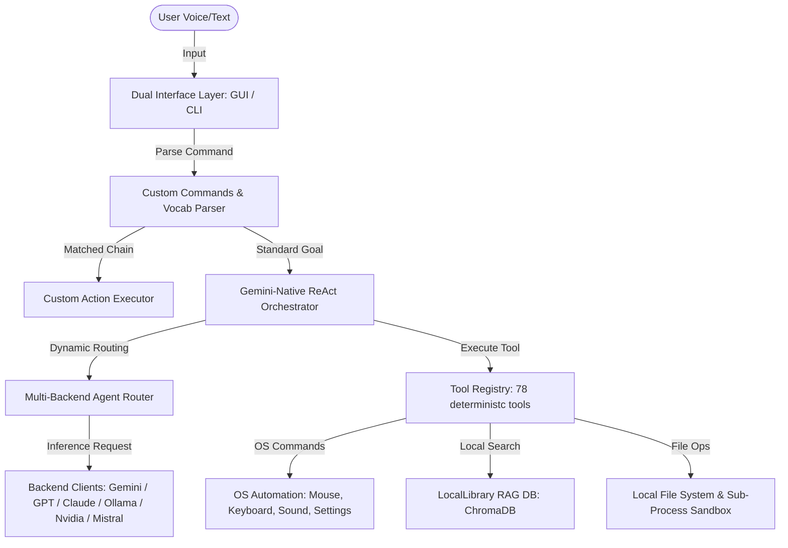

# JARVIS MK37 — Full Project Summary & Architecture Guide

Welcome to the comprehensive documentation for **JARVIS MK37**, a next-generation, local-first, multi-modal cognitive assistant. It combines direct desktop/OS integration, advanced multi-backend routing, multi-agent task execution, and offline capabilities.

---

## 1. System Architecture Overview

JARVIS MK37 operates using a decoupled, modular design divided into distinct operational layers:



---

## 2. Core Capabilities

### 2.1 Multi-Backend Routing & Fallback (`router.py`)
- JARVIS utilizes an intelligent `AgentRouter` to dynamically select the best LLM backend for a task based on keyword signatures.
- Supported backends include **Gemini** (vision/long context), **GPT/OpenAI compatible** (local proxy gateway), **Claude** (coding), **Ollama** (offline/private), **NVIDIA NIM**, and **Mistral**.
- **Self-Healing Fallback**: If a backend call raises an exception (e.g. 504 Timeout or Connection Error), the router automatically redirects the request to the fallback **Gemini** backend, ensuring continuous operations.

### 2.2 Dual User Interfaces
- **Voice GUI Interface (`voice/assistant.py`)**: Hands-free spoken interaction loop using calibrated audio inputs, wake word detection, and dynamic visual indicators.
- **CLI REPL Orchestrator (`main_mk37.py`)**: A terminal interface designed for power users, offering rich formatting, task queues, and slash commands.

---

## 3. Restructured & Enhanced Features (Braina-Inspired)

We have restructured the project to support the following advanced capabilities:

### 3.1 Multilingual & Offline Speech Recognition (`voice/multilingual.py`, `voice/whisper_local.py`)
- **90 Languages Supported**: High-accuracy speech recognition mapped across 90+ locales for both Google STT and local engines.
- **100% Offline Mode**: Local inference using OpenAI Whisper models (`faster-whisper` and `openai-whisper` wrappers). Enabled by setting `JARVIS_OFFLINE_STT=true` in the environment.
- **Robust Wake Word & Calibrations**: Supports lenient matching for *"hey jarvis"*, *"jarvis"*, and phonetic variants like *"javis"* anywhere in transcription. Includes adjustable phrase time limits and ambient noise calibration.

### 3.2 LocalLibrary RAG - Document Chat (`actions/rag_library.py`)
- **Document Ingestion**: Extract and chunk text from **PDFs**, **DOCX**, **CSV**, **TXT**, **Webpages**, and **Screenshots** (via OCR).
- **Vector Storage**: Stores text embeddings in a local ChromaDB instance (`memory_db/rag_library`).
- **RAG Skills**: Chat directly with your documentation using `/chat-pdf [file]`, `/chat-webpage [url]`, or `/library` to list and delete files.

### 3.3 Offline File Transcription (`actions/transcriber.py`)
- Transcribe audio files (`.mp3`, `.wav`, `.m4a`) or video files (`.mp4`, `.mkv`, `.webm`) directly to text.
- Automatically extracts audio from video formats using `ffmpeg` and outputs transcribed text to **TXT**, **JSON**, or subtitle files (**SRT**, **WebVTT**).

### 3.4 Custom Commands, Replies, & Variables (`actions/custom_commands.py`)
- Create programmable action chains mapped to custom voice or text triggers.
- Mapped in [config/custom_commands.json](file:///d:/MARKJARVIS/Jarvis-MK37/config/custom_commands.json):
  - **Variable substitutions** (e.g., `search google for $QUERY`).
  - **Sequential execution** of speak, open app, open URL, key stroke typing, hotkeys, or shell command actions.
  - **Startup Commands** that execute automatically on boot.

### 3.5 Global Hotkeys System (`actions/hotkeys.py`)
- Global system-wide keyboard shortcuts configured in `config/hotkeys.json`:
  - `Ctrl+Shift+J` — Toggle voice assistant listening.
  - `Ctrl+Shift+C` — Read clipboard text and ask the AI.
  - `Ctrl+Shift+S` — Take a screenshot and analyze with Vision.

### 3.6 AI Image & Video Generation (`actions/image_generator.py`, `actions/video_generator.py`)
- **Image Generation**: Generate images via voice or text prompts using Gemini Imagen 3, DALL-E 3, or Stability AI. Saves to `workspace/generated_images/`.
- **Video Generation**: Create short videos via Google Veo or Kling AI. Saves to `workspace/generated_videos/`.

### 3.7 AI Writing Assistant (`skills/builtin_writer.py`)
- Built-in skills to compose essays, draft emails, write blogs, proofread grammar, translate text, or create structured reports.

### 3.8 Chat Log Exporter (`actions/chat_export.py`)
- Export conversational exchanges as a styled **PDF**, **HTML** file, **Markdown** log, or **Plain Text** file, stored in `workspace/exports/`.

### 3.9 Dynamic Renaming & Vocabulary Corrections (`config/vocabulary.json`)
- Rename the assistant and wake word in the `.env` settings.
- Map custom vocabulary overrides (e.g. mapping misheard transcriptions like *"bee are"* to *"BR"* or *"local library"* to *"LocalLibrary"*) to maximize STT accuracy.

---

## 4. Configuration Environment Variables

Configure these settings in your [**.env**](file:///d:/MARKJARVIS/Jarvis-MK37/.env) file:

```env
# ── Assistant Profile Configuration ───────────────────
JARVIS_ASSISTANT_NAME=BR             # The name of your assistant
JARVIS_WAKE_WORD=hey                 # Wake word to trigger listening

# ── Offline / Multilingual STT Settings ──────────────
JARVIS_OFFLINE_STT=false             # Set to true to use local Whisper model
JARVIS_WHISPER_MODEL=base            # Whisper model: tiny | base | small | medium | large-v3
JARVIS_VOICE_LANGUAGE=en             # Language code (e.g. en, es, fr, hi, zh)

# ── Media Output Settings ─────────────────────────────
JARVIS_IMAGE_DIR=workspace/generated_images
JARVIS_VIDEO_DIR=workspace/generated_videos
```

---

## 5. Verification Command

You can verify that all 78 tools and 56 skills are correctly registered and loadable by running:
```powershell
python scripts/smoke_startup.py
```
All 5/5 startup smoke checks must pass successfully.
