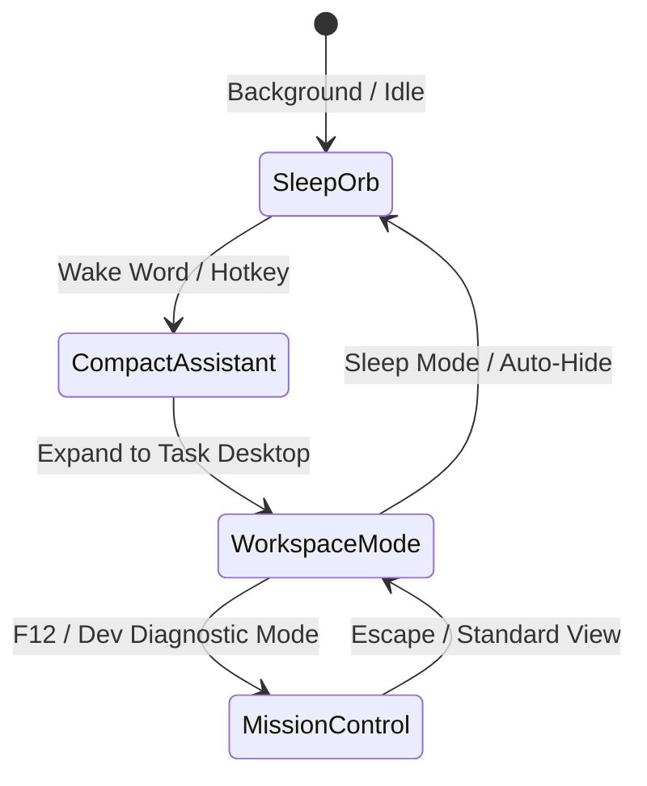

# B.R. JARVIS MK37 — UI & UX Master Design Specification (v6.0)

> **Next-Gen AI OS Control Center — Colorful Glossy Glassmorphic Interface & AI OS Architecture**  
> *Architectural Blueprint for User Interface (UI), User Experience (UX), Design System Tokens, Four Operating States, and Implementation Roadmap.*

---

## 🔗 Master Architectural Blueprints

- 📄 **[AI OS Master Redesign Specification](file:///d:/BRJARVIS/Br-Jarvis/br_archetecture/ui_img/AI_OS_REDESIGN_MASTER_SPEC.md)** — Complete next-generation AI OS design system, dynamic wallpaper sampler engine, physical motion guidelines, 4 operating states (Sleep Orb, Compact Assistant, Workspace Mode, Mission Control), Max Control Center, and modern web stack handoff.
- 📐 **[Original Prompt Vision Specification](file:///d:/BRJARVIS/Br-Jarvis/br_archetecture/ui_img/redesign.md)** — Core design principles and goals.
- 🖥️ **[Current UI Implementation (ui.py)](file:///d:/BRJARVIS/Br-Jarvis/ui.py)** — Active Tkinter/Pillow GUI implementation (12 integration tiles, dynamic particles, equalizer waveform).

---

## 🎨 Core Design Philosophy & Principles

### 1. Cyberpunk Frosted Glassmorphism
- **Depth & Translucency**: UI panels utilize translucent dark frosted glass (`#111722` / `rgba(15,22,35,0.65)`) layered above a deep space canvas background (`#06090e`).
- **Glossy Neon Glow Borders**: Hover states and active focus indicators trigger vibrant neon borders (`#00e5ff`, `#bf5af2`, `#30d158`) with subtle radial elevation.
- **Visual Contrast**: Dark background matrices ensure high contrast (WCAG AA compliant) with neon accents and crisp text typography.

### 2. Four Primary Operating States Architecture

1. **State 1 — Sleep Mode (Floating Orb)**: Always-on-top ambient floating glass sphere with magnet edge snapping, particle halo, and auto-hide transparency.
2. **State 2 — Compact Assistant**: 250ms spring transition into a floating widget with quick replies, waveform audio feedback, and clipboard context actions.
3. **State 3 — Workspace Mode**: Modular multi-window dashboard (Planner, Reasoning Tree, Computer Operator, Vision Inspector, System Health, Neural Event Log).
4. **State 4 — Mission Control**: Fullscreen developer diagnostic view featuring the live EventBus node graph, 3D Memory Vector Space, and Token Budget Profiler.

---

## 📐 Design System & Color Tokens

### 1. Color Palette Matrix (`C`)

| Token | Hex Value | Purpose / Usage |
| :--- | :--- | :--- |
| `bg` | `#06090e` | Deep dark space canvas background |
| `bg_trans` | `#0b1018` | Translucent glass backdrop overlay |
| `surface` | `#111722` | Right panel & navigation bar surface |
| `card` | `#17202f` | Tile card default surface |
| `card_h` | `#202b3f` | Card hover state background |
| `card_glow` | `#2d3d59` | Frosted elevation shadow & border glow |
| `border` | `#263449` | Standard structural panel border |
| `border_glow`| `#00e5ff` | Focused input border & active neon glow |
| `accent` | `#0088ff` | Primary action button / Electric Blue |
| `accent_l` | `#40a9ff` | Light blue text highlight & status |
| `cyan` | `#00f2fe` | AI speaking state, prompt icon, cyan highlight |
| `purple` | `#bf5af2` | AI thinking state, telemetry header |
| `pink` | `#ff2d55` | Core notification, neural log accent |
| `green` | `#30d158` | AI listening state, success badges |
| `amber` | `#ff9f0a` | System warnings & alerts |
| `magenta` | `#ff007f` | Music integration & active media badge |

---

## 🎛️ Max Control Center & OS Settings Hub

Accessible via HUD or shortcut (`Ctrl + Shift + C`), **Max Control Center** provides instant zero-nested configuration across 16 core categories:
- **Voice & Vision Engines**: Wake-word sensitivity, STT/TTS models, OCR confidence threshold, high-FPS screen capture.
- **AI Models & Memory**: Provider router prioritizations, vector memory pruning, offline local LLMs (Ollama), token budget limits.
- **Hardware & System**: GPU acceleration, Windows DWM Acrylic blur intensity, dynamic wallpaper color adaptation engine.

---

## ⌨️ Fast Ergonomic Hotkeys

| Key Combination | Function |
| :--- | :--- |
| `<Alt + Space>` | Toggle Compact Assistant |
| `<F4>` | Toggle Voice Microphone Mute |
| `<F5>` | Set AI State to `LISTENING` |
| `<F11>` | Toggle Floating Sleep Orb |
| `<F12>` | Toggle Fullscreen Mission Control Mode |
| `<Control + Shift + C>` | Open Max Control Center |
| `<Escape>` | Focus Command Input / Dismiss Overlay |
| `<Control + L>` | Clear Neural Event Log |

---

## 🛠️ Code Structure & Core Files

- Master AI OS Spec: [AI_OS_REDESIGN_MASTER_SPEC.md](file:///d:/BRJARVIS/Br-Jarvis/br_archetecture/ui_img/AI_OS_REDESIGN_MASTER_SPEC.md)
- Current Python UI Implementation: [ui.py](file:///d:/BRJARVIS/Br-Jarvis/ui.py)
- Application Launcher: [start.py](file:///d:/BRJARVIS/Br-Jarvis/start.py)
- Main Event Orchestrator: [main_mk37.py](file:///d:/BRJARVIS/Br-Jarvis/main_mk37.py)
- Architecture Folder: [br_archetecture](file:///d:/BRJARVIS/Br-Jarvis/br_archetecture)

---

> *UI & UX Master Design Specification maintained by the B.R. JARVIS Product Architecture Team.*
