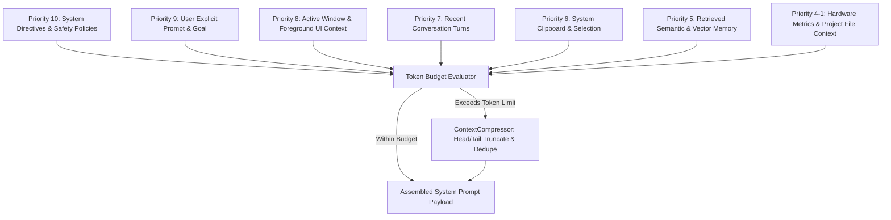

# 🧠 BR JARVIS — Context Engine Architecture (`context/`)

> **Document Status**: Production Specification  
> **Subsystem**: AI & Prompt Intelligence  
> **Module Path**: `context/`  

---

## 1. Executive Summary

Context is the primary resource budget in Large Language Model (LLM) applications. The BR JARVIS **Context Engine** (`context/`) dynamically builds, tokenizes, prioritizes, and compresses multi-source runtime context into a unified system prompt payload. It enforces model-specific token budgets while ensuring critical instructions, active window states, system health metrics, and relevant memories are included.

---

## 2. Component Taxonomy & Responsibilities

| File | Class / Entity | Primary Responsibility |
|---|---|---|
| [builder.py](file:///d:/BRJARVIS/Br-Jarvis/context/builder.py) | `ContextBuilder` | Multi-source context aggregator across 7 priority tiers |
| [compressor.py](file:///d:/BRJARVIS/Br-Jarvis/context/compressor.py) | `ContextCompressor` | Truncation, line deduplication, and head/tail summary compression |
| [engine.py](file:///d:/BRJARVIS/Br-Jarvis/context/engine.py) | `ContextEngine` | Master subsystem coordinator registered in `CoreRuntime.container` |
| [token_counter.py](file:///d:/BRJARVIS/Br-Jarvis/context/token_counter.py) | `TokenCounter` | Fast `tiktoken` counting with heuristic ratio fallbacks |
| [token_manager.py](file:///d:/BRJARVIS/Br-Jarvis/context/token_manager.py) | `TokenManager` | Budget allocation per scope & model context window limit enforcement |
| [types.py](file:///d:/BRJARVIS/Br-Jarvis/context/types.py) | `ContextItem`, `AssembledContext` | Pydantic v2 schemas for context scopes, priorities, and assembled buffers |

---

## 3. Priority Hierarchy & Context Scopes

The `ContextBuilder` aggregates data into `ContextItem` instances classified under 7 distinct scopes with explicit priority weights (ranging from 10 = Highest down to 1 = Lowest):



### Context Scopes & Priority Allocation

1. **`SYSTEM_STATE` (Priority 10)**: Core runtime state, safety policies, tool execution rules.
2. **`USER_GOAL` (Priority 9)**: Active user command or DAG step definition.
3. **`ACTIVE_WINDOW` (Priority 8)**: Focused application window metadata, screen OCR snippet, and active URL.
4. **`CONVERSATION` (Priority 7)**: Recent conversation turns from `memory/working.py`.
5. **`CLIPBOARD` (Priority 6)**: OS clipboard contents.
6. **`MEMORY` (Priority 5)**: RAG vector context and recalled episodic memories.
7. **`PROJECT_FILES` (Priority 4-1)**: Attached workspace files, code context, and environment settings.

---

## 4. Context Compression Algorithm

When total assembled tokens exceed the backend model's limit (e.g. 128,000 for standard models or 1,000,000 for Gemini 1.5/2.0), `ContextCompressor` executes a 3-stage optimization pipeline:

1. **Redundancy Stripping**: Removes duplicate blank lines, repetitive system logs, and trailing spaces.
2. **Priority-Based Pruning**: Drops lower-priority items (Priority <= 4) starting with large project file dumps.
3. **Head / Tail Truncation**: For large text buffers, retains the first `N` lines (head) and last `M` lines (tail) while replacing intermediate content with a token-counted summary placeholder:
   ```
   [... Compression: 4,200 tokens omitted from middle of log buffer ...]
   ```

---

## 5. System Integration & Code Interface

```python
from context.engine import ContextEngine
from context.types import AssembledContext

# Initialize via DI container or directly
context_engine = ContextEngine(max_tokens=8192)

# Assemble system prompt payload for current prompt & state
assembled: AssembledContext = context_engine.assemble_context(
    user_input="Analyze recent codebase changes and compile report",
    include_memory=True,
    include_active_window=True
)

print(f"Total Tokens Used: {assembled.total_tokens} / {assembled.max_allowed_tokens}")
```
