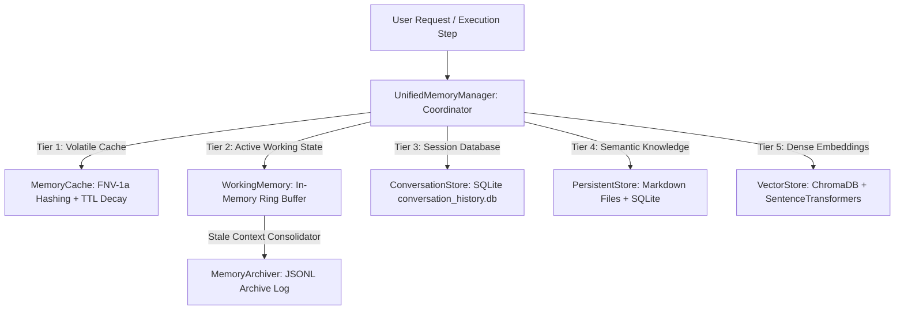

# 🧠 BR JARVIS — Multi-Tier Advanced Memory Engine (`memory/`)

> **Document Status**: Production Architecture Specification  
> **Subsystem**: Memory & Knowledge Retention  
> **Module Path**: `memory/`  

---

## 1. Executive Summary

The BR JARVIS **Memory Engine** provides a 4-tier hybrid storage architecture enabling zero-latency volatile caching, durable relational session storage, cross-session persistent markdown state, and local vector retrieval (RAG).

---

## 2. Multi-Tier Architecture Overview

---

## 3. Subsystem Components & Responsibilities

| Subsystem Module | Class / Component | Function & Storage Mechanism |
|---|---|---|
| [working.py](file:///d:/BRJARVIS/Br-Jarvis/memory/working.py) | `WorkingMemory` | Rapid in-memory storage for active turn history and transient execution variables. |
| [cache.py](file:///d:/BRJARVIS/Br-Jarvis/memory/cache.py) | `MemoryCache` | In-memory key-value cache with TTL expiration and C++ FNV-1a hash key generation. |
| [conversation_store.py](file:///d:/BRJARVIS/Br-Jarvis/memory/conversation_store.py) | `ConversationStore` | SQLite persistent database for full conversation thread history, system prompts, and tool outputs. |
| [persistent_store.py](file:///d:/BRJARVIS/Br-Jarvis/memory/persistent_store.py) | `PersistentStore` | Dual-mode persistent store maintaining Markdown state files (`MEMORY.md`, `PREFERENCES.md`) & key-value SQLite tables. |
| [vector_store.py](file:///d:/BRJARVIS/Br-Jarvis/memory/vector_store.py) | `VectorStore` | Local ChromaDB vector database with `all-MiniLM-L6-v2` dense embedding generation for semantic document RAG. |
| [consolidator.py](file:///d:/BRJARVIS/Br-Jarvis/memory/consolidator.py) | `MemoryConsolidator` | Background worker that extracts long-term user facts and semantic insights from dialogue turns. |
| [archiver.py](file:///d:/BRJARVIS/Br-Jarvis/memory/archiver.py) | `MemoryArchiver` | Archives completed session turns into compressed `workspace/logs/memory_archive.jsonl`. |
| [memory_scan.py](file:///d:/BRJARVIS/Br-Jarvis/memory/memory_scan.py) | `MemoryScan` | Full-text and regex search scanner across persistent session records and log archives. |
| [unified_memory.py](file:///d:/BRJARVIS/Br-Jarvis/memory/unified_memory.py) | `UnifiedMemoryManager` | Master façade providing seamless query operations across working, SQLite, vector, and cache tiers. |

---

## 4. Operational Data Flow & Consolidation

1. **Write Flow**: Incoming user and agent turns are appended to `WorkingMemory` and asynchronously committed to `ConversationStore` (SQLite).
2. **Read Flow**: Queries check `MemoryCache` first. If cache misses occur, `UnifiedMemoryManager` merges results from `WorkingMemory`, `ConversationStore`, and `VectorStore`.
3. **Consolidation**: Stale conversation turns are periodically processed by `MemoryConsolidator` to extract user rules and preferences, writing them to `PersistentStore` (`MEMORY.md`), before `MemoryArchiver` offloads raw turns to `memory_archive.jsonl`.
