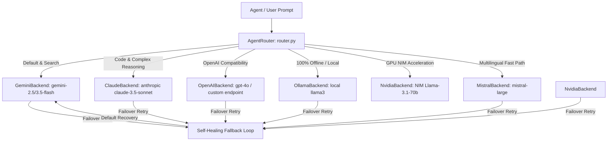

# 🔀 BR JARVIS — Intelligent Multi-Backend Model Router (`router.py`)

> **Document Status**: Production Architecture Specification  
> **Subsystem**: Multi-Model Intelligence & Failover Router  
> **Module Path**: `router.py` & `backends/`  

---

## 1. Executive Summary

BR JARVIS features an intelligent, task-aware multi-backend router (`AgentRouter` in `router.py`) coupled with a provider backend framework in `backends/`. The system guarantees zero-downtime execution by prioritizing Gemini as the primary backbone while dynamically routing specialised tasks (such as offline privacy, local GPU acceleration, complex code generation, or multilingual processing) across available model providers.

---

## 2. Supported LLM Backends (`backends/`)



### Backend Adapter Taxonomy

| Backend Class | File Path | Default Model ID | Key Capabilities |
|---|---|---|---|
| `GeminiBackend` | [backends/gemini.py](file:///d:/BRJARVIS/Br-Jarvis/backends/gemini.py) | `gemini-2.5-flash` / `gemini-3.5-flash` | Google Search grounding, native vision, 1M+ token context window, structured JSON mode. |
| `ClaudeBackend` | [backends/anthropic.py](file:///d:/BRJARVIS/Br-Jarvis/backends/anthropic.py) | `claude-3-5-sonnet-20241022` | Complex code synthesis, multi-step ReAct planning, precise docstring generation. |
| `OpenAIBackend` | [backends/openai_compat.py](file:///d:/BRJARVIS/Br-Jarvis/backends/openai_compat.py) | `gpt-4o` / `gpt-4o-mini` | OpenAI API compatibility, function calling, fallback provider. |
| `OllamaBackend` | [backends/ollama.py](file:///d:/BRJARVIS/Br-Jarvis/backends/ollama.py) | `llama3:latest` | 100% offline air-gapped processing, zero external telemetry, local privacy mode. |
| `NvidiaBackend` | [backends/nvidia.py](file:///d:/BRJARVIS/Br-Jarvis/backends/nvidia.py) | `meta/llama-3.1-70b-instruct` | High-throughput GPU inference acceleration via NVIDIA NIM microservices. |
| `MistralBackend` | [backends/mistral.py](file:///d:/BRJARVIS/Br-Jarvis/backends/mistral.py) | `mistral-large-latest` | Fast multilingual translation and compact reasoning. |

---

## 3. Intelligent Routing Rules & Fallback Policy

Task requests pass through `ROUTING_RULES` mapping to select candidate backends in order of preference:

```python
ROUTING_RULES = {
    "code":           [AgentProfile.GEMINI, AgentProfile.CLAUDE, AgentProfile.GPT],
    "security":       [AgentProfile.GEMINI, AgentProfile.CLAUDE],
    "creative":       [AgentProfile.CLAUDE, AgentProfile.GEMINI, AgentProfile.GPT],
    "search":         [AgentProfile.GEMINI],
    "local_private":  [AgentProfile.OLLAMA, AgentProfile.GEMINI],
    "long_context":   [AgentProfile.GEMINI, AgentProfile.CLAUDE],
    "gpu_inference":  [AgentProfile.NVIDIA, AgentProfile.GEMINI],
    "fast_inference": [AgentProfile.GEMINI, AgentProfile.MISTRAL],
    "multilingual":   [AgentProfile.GEMINI, AgentProfile.MISTRAL],
    "vision":         [AgentProfile.GEMINI],
    "analysis":       [AgentProfile.GEMINI, AgentProfile.CLAUDE, AgentProfile.GPT],
}
```

### Self-Healing Failover Algorithm
1. **Health Verification**: Before dispatching, `AgentRouter.generate()` checks backend availability via key verification or active ping (e.g. `OllamaBackend.ping(timeout=2.0)`).
2. **Graceful Fallback**: If the selected backend returns an HTTP exception (e.g., rate limit 429, timeout 504), the router catches the error, logs telemetry via `EventBus`, and immediately falls back to `GeminiBackend`.
3. **Runtime Switching**: Users or automated planners can dynamically override the active backend at runtime via `/model <name>` CLI commands or `AgentRouter.switch_backend()`.
