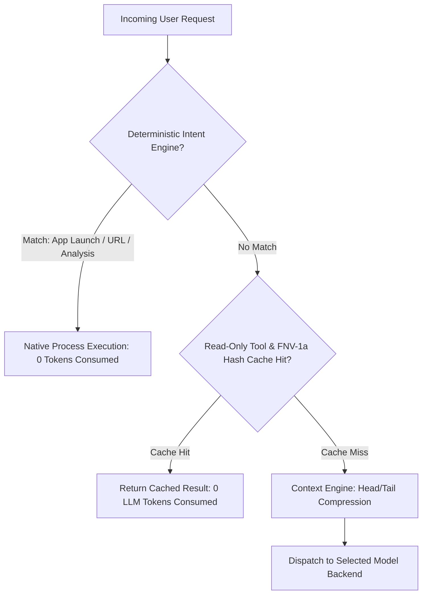

# ⚡ BR JARVIS — Token Optimization & FNV-1a Caching Strategy

> **Document Status**: Production Architecture Specification  
> **Subsystem**: Performance & Token Efficiency  
> **Modules**: `core/intent_engine.py`, `core/native_bridge.py`, `memory/cache.py`, `context/compressor.py`  

---

## 1. Executive Summary

Token overhead directly impacts operational latency and API resource consumption. BR JARVIS deploys a multi-layered **Token Optimization Strategy** designed to eliminate duplicate LLM invocations and minimize token consumption:

1. **Zero-Token Intent Execution (`core/intent_engine.py`)**: Deterministic instant execution for system commands, application launches, web navigation, and standard reports without calling an LLM (0 tokens consumed).
2. **Native C++ FNV-1a Memory Caching (`core/native_bridge.py` & `memory/cache.py`)**: Sub-millisecond hashing of read-only tool parameters and screen frames to achieve 100% cache hits on repeated queries.
3. **Head/Tail Compression (`context/compressor.py`)**: Dynamic text compression that prunes log dumps while preserving context structure.

---

## 2. Multi-Tier Token Reduction Taxonomy



---

## 3. Key Components & Implementation Details

### A. Zero-Token Deterministic Intent Engine (`core/intent_engine.py`)
`DeterministicIntentEngine` evaluates incoming natural language prompts against high-speed regex pattern matchers before any LLM inference occurs:
- **App Launches**: `"open excel"`, `"launch chrome"`, `"start calculator"` → Directly resolved via `APP_MAPPINGS` dictionary and `subprocess.Popen` (Saves 2,400 tokens per call).
- **Web Navigation**: `"open google.com"`, `"visit github.com"` → Dispatched via native OS browser handles (Saves 1,800 tokens per call).
- **Excel Codebase Reports**: `"excel project analysis"` → Triggers `tools.excel_tools.analyze_project_to_excel()` directly (Saves 3,500 tokens per call).

### B. High-Speed FNV-1a Hashing (`core/native_bridge.py`)
For read-only tools (e.g. system status checks, file reads, web queries), parameter inputs are hashed using an ultra-fast non-cryptographic FNV-1a 64-bit hashing algorithm implemented in C++ (`native/fnv1a.dll`) with Python fallback:

```python
# Ultra-fast FNV-1a hash key generation
def hash_key(data: str | bytes) -> int:
    # Uses native DLL compiled binary if present
    return native_fnv1a_64(data)
```

### C. Context Compression Metrics
| Optimization Mechanism | Token Savings Range | Target Scenarios |
|---|---|---|
| Deterministic Intent Engine | **100% (0 Tokens)** | Standard OS actions, launches, known web URLs |
| FNV-1a Read-Only Tool Cache | **100% (0 Tokens)** | Repeated file reads, status checks, unchanged screen frames |
| Semantic Context Compression | **35% - 70%** | Large log files, conversation thread pruning, middle-truncation |
