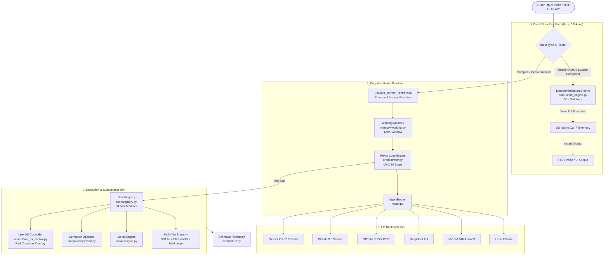
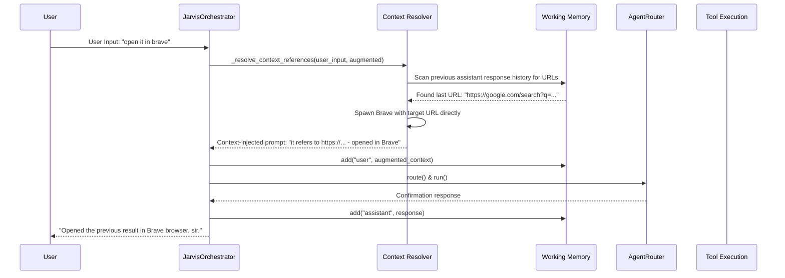

# 🏗️ BR JARVIS — Architecture & System Topology Specification

> **Document Status**: Production Architecture Specification  
> **Version**: MK37.25 (Round 24 Voice Upgrades + Round 25 Context Fix)  
> **Coverage**: Subsystems 1 to 15 (Guardian, Self-Upgrade, Tiered Path Policy, Reflection, Core Runtime, Reasoning, Workflow, Autonomous Planner/Executor, Multi-Agent, Multi-LLM Router, Context Engine, Memory Engine, Computer Operator, Vision Engine, Voice Subsystem)

---

## 1. High-Level System Topology

BR JARVIS operates as a decoupled, asynchronous, local-first AI Operating System with a two-tier execution pipeline:

1. **Zero-Token Instant Fast Path**: Immediate 0ms deterministic execution via regex matchers in `core/intent_engine.py` (0 LLM token cost).
2. **ReAct Cognitive Pipeline**: Multi-backend LLM orchestration loop (`orchestrator.py` + `router.py`) with context-aware pronoun resolution, tool execution, memory retrieval, and visual OS control.

---

## 2. Conversation & Context Resolution Sequence

---

## 3. Core Architectural Rules & Standards

1. **Zero-Token First**: Always check `DeterministicIntentEngine` before hitting LLM backends.
2. **Context Integrity**: Every incoming user message MUST be pushed to `WorkingMemory` before any LLM inference step.
3. **Pronoun Traceability**: Anaphoric references ("it", "that", "this") are resolved against previous turn artifacts/URLs before execution.
4. **Visual Action Audit**: Every Live OS click/type action saves a red crosshair visual trace file (`step_{n}_action.png`) for debugging and verification.
5. **Guardian Safety Interlocks**: High-risk system operations check `permissions.py` PathPolicy and `guardian/kill_switch.py`.
