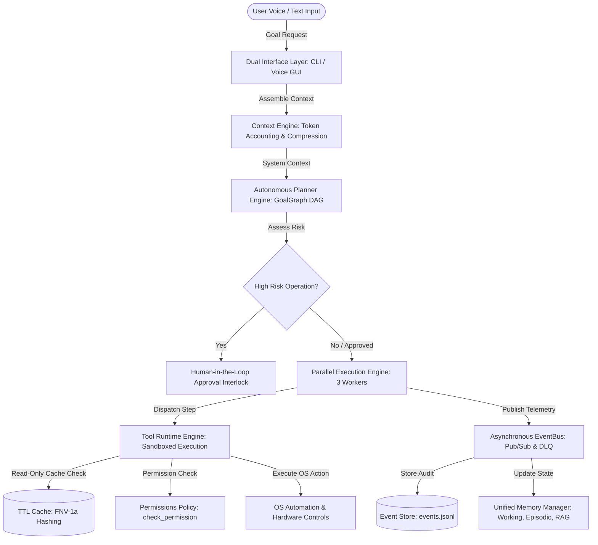
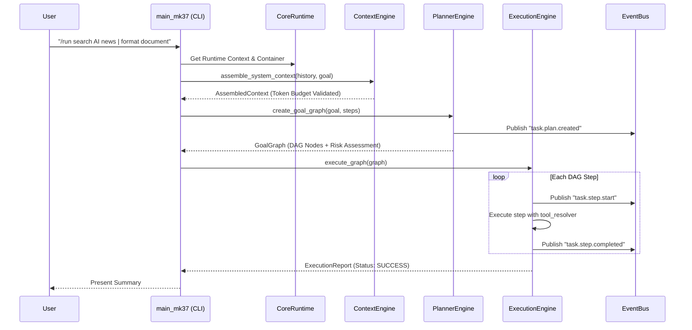

# 🏗️ BR JARVIS — Core Architecture & System Topology

> **Document Status**: Production Architecture Specification  
> **Subsystems Covered**: Subsystems 1 to 8 (Core Runtime, Event Bus, Context Engine, Memory Engine, Planner, Executor, Tool Runtime, Plugin Platform)

---

## 1. High-Level Architecture Topology

BR JARVIS operates as a decoupled, asynchronous, event-driven Local AI Operating System. 

---

## 2. Core Subsystems Interaction Flow

---

## 3. Core Operational Principles

1. **Dependency Injection**: Services register interfaces in `CoreRuntime.container` (`Container`).
2. **Event-Driven Telemetry**: Every state change publishes Pydantic v2 event models on `EventBus`.
3. **Strict Token Budgeting**: Prompts are passed through `ContextEngine` to ensure token counts stay within model limits.
4. **Zero Duplicate Computations**: Read-only tools check `MemoryCache` using fast FNV-1a hashing before invocation.
