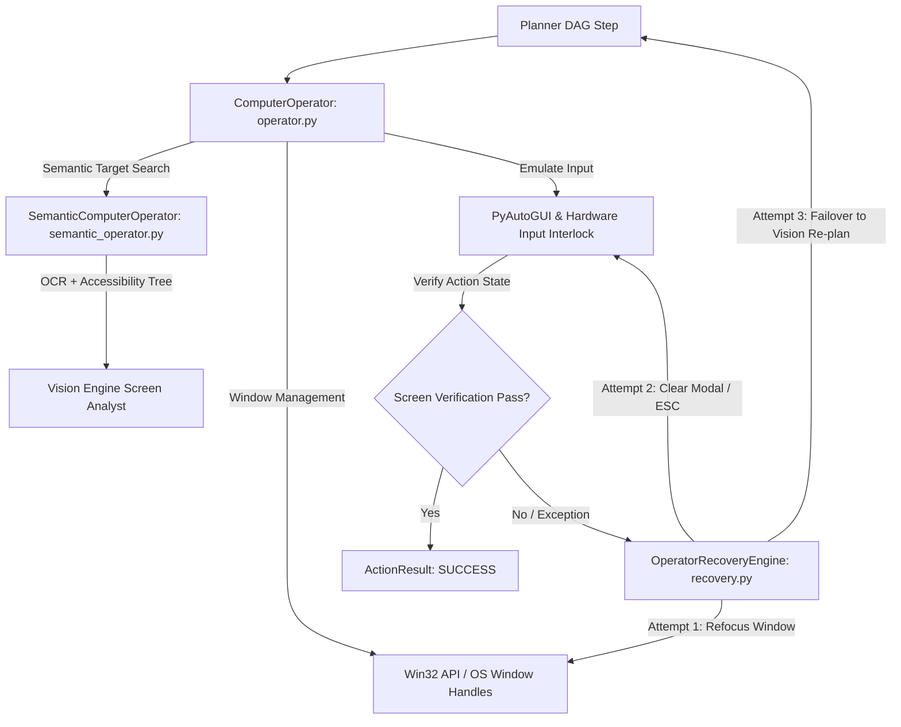

# 🖥️ BR JARVIS — Computer Operator Subsystem (`computer/`)

> **Document Status**: Production Architecture Specification  
> **Subsystem**: Hands-Free OS Automation & Desktop Control  
> **Module Path**: `computer/`  

---

## 1. Executive Summary

The **Computer Operator** subsystem (`computer/`) grants BR JARVIS human-level OS control across Windows, Linux, and macOS. It combines PyAutoGUI hardware emulation, Win32 window handles, visual element localization (`semantic_operator.py`), and automated fault recovery (`recovery.py`) to execute desktop tasks safely.

---

## 2. Architecture & Subsystem Mapping

---

## 3. Subsystem Components & Responsibilities

| File | Primary Class | Function & OS Interlocks |
|---|---|---|
| [operator.py](file:///d:/BRJARVIS/Br-Jarvis/computer/operator.py) | `ComputerOperator` | Master automation operator handling click, double_click, drag, type_text, key_combination, mouse_scroll, and active window switching. Implements PyAutoGUI corner failsafes and speed bounds. |
| [semantic_operator.py](file:///d:/BRJARVIS/Br-Jarvis/computer/semantic_operator.py) | `SemanticComputerOperator` | High-level GUI element finder that maps natural language labels (e.g. `"Submit Button"`, `"Search Bar"`) to bounding box coordinates via `vision/ocr_engine.py` and accessibility trees. |
| [recovery.py](file:///d:/BRJARVIS/Br-Jarvis/computer/recovery.py) | `OperatorRecoveryEngine` | Self-healing recovery loop handling lost window focus, popup interruptions, mouse drift, and action verification failures. |
| [types.py](file:///d:/BRJARVIS/Br-Jarvis/computer/types.py) | `ComputerAction`, `ActionResult` | Pydantic v2 schemas for action payloads, coordinate targets, execution status, and screenshot verification diffs. |

---

## 4. Safety Policy & Human-in-the-Loop Interlocks

To prevent unauthorized or destructive operations, `ComputerOperator` integrates directly with `permissions.py`:
1. **Destructive Operations**: Disk partitioning, system file modifications, registry edits, or force killing system processes automatically trigger human consent confirmation (`requires_approval=True`).
2. **PyAutoGUI Failsafe**: Moving the mouse cursor to any screen corner instantly triggers `pyautogui.FailSafeException`, immediately aborting mouse automation.
3. **Execution Verification**: Every GUI operation captures a before-and-after frame hash (`native_bridge.hash_key`) to confirm expected UI state transition.
