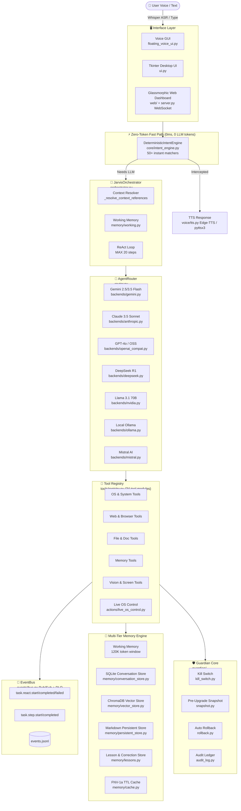
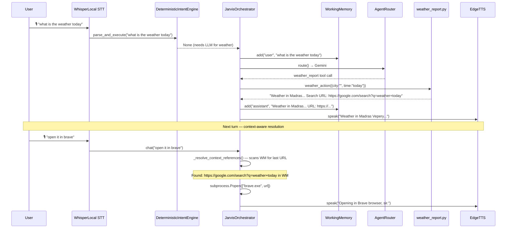

# 🌌 BR JARVIS — Master Architecture Record & Full Project Specification

> **System Identity**: BR JARVIS (Project BR / JARVIS MK37)  
> **Version**: MK37.25 — Round 24 Voice Upgrade Series  
> **Target Platform**: Windows 11 / Linux / macOS  
> **Last Updated**: 2026-07-23  
> **Project Scale**: 248 Python source files | 398 total files | 22.49 MB  
> **Test Coverage**: 112 independent checks passing across 3 suites: 60 pytest (unit+integration) + 42 standalone test_deep_audit.py + 10 standalone scripts/smoke_startup.py (0 failures)

---

## 1. Executive Summary & Vision

**BR JARVIS** is a local-first, multi-modal cognitive AI operating system built for autonomous PC control, hands-free voice interaction, multi-backend LLM routing, screen vision, self-improvement, and immutable safety governance.

It is not a simple chatbot wrapper — it is a full **AI Operating System** with 15 specialized subsystems working together in an asynchronous, event-driven architecture.

### 🎯 Core Architectural Principles

| Principle | Implementation | Status |
|---|---|---|
| **Zero-Token Instant Execution** | `core/intent_engine.py` — 50+ deterministic matchers executing system commands in 0ms, 0 LLM tokens | ✅ Production |
| **Context-Aware Pronoun Resolution** | `orchestrator._resolve_context_references()` — resolves "open it in brave" using conversation history | ✅ New (Round 25) |
| **Multi-Backend LLM Routing** | `router.py` — 7 backends: Gemini, Claude, GPT, DeepSeek, NVIDIA, Ollama, Mistral | ✅ Production |
| **Immutable Guardian Core** | `guardian/` — kill-switch, snapshot, rollback, audit ledger | ✅ Production |
| **Autonomous Self-Upgrade** | `evolution/` — blast-radius classifier, sandbox testing, auto-deploy | ✅ Production |
| **Multi-Tier Memory** | `memory/` — 5 storage tiers: Working, SQLite, ChromaDB, LessonStore, FNV-1a cache | ✅ Production |
| **Live OS Vision Control** | `actions/live_os_control.py` — screenshot→LLM→action loop with visual grounding trace | ✅ Production |
| **Deep Desktop Automation** | `computer/`, `actions/computer_control.py` — Win32, PyAutoGUI, accessibility trees | ✅ Production |
| **7-Tier Vision Pipeline** | `vision/` — screen capture, OCR, DOM bridge, accessibility, hybrid pipeline | ✅ Production |

---

## 2. System Architecture Topology



---

## 3. Data Flow — Voice Command ("what is the weather today" → "open it in brave")



---

## 4. Module Map — 15 Subsystems (Verified Inventory)

### Subsystem 1 — Guardian Core (`guardian/`)
| File | Role |
|---|---|
| `core.py` | Guardian initialization, integrity orchestration |
| `kill_switch.py` | Global pause/halt capability |
| `snapshot.py` | Pre-upgrade Git + SQLite snapshots |
| `rollback.py` | Automated rollback on test failure |
| `audit_log.py` | Append-only autonomy audit ledger |
| `autonomy_policy.yaml` | Policy configuration for autonomy tiers |

### Subsystem 2 — Self-Upgrade Engine (`evolution/`)
| File | Role |
|---|---|
| `proposer.py` | Generates code change proposals |
| `classifier.py` | LOW/MEDIUM/HIGH blast-radius classification |
| `sandbox.py` | Isolated verification testing |
| `deployer.py` | Atomic deployment with rollback on failure |
| `digest.py` | Human-readable change digest |

### Subsystem 3 — Core Runtime (`core/`)
| File | Role |
|---|---|
| `intent_engine.py` | **DeterministicIntentEngine** — 50+ zero-token matchers (64KB, 1343 lines) |
| `di.py` | Dependency injection container |
| `runtime.py` | System runtime state |
| `config.py` | Pydantic v2 settings with env validation |
| `lifecycle.py` | Startup/shutdown lifecycle hooks |
| `compat.py` | Orchestrator integration shim |
| `native_bridge.py` | C native FNV-1a hash via LLVM |
| `workspace_engine.py` | Workspace context management |
| `health.py` | Health check subsystem |
| `logging.py` | Structured logging |
| `process.py` | Process supervisor |
| `retry.py` | Exponential backoff decorator |
| `timeouts.py` | Centralized timeout configuration |
| `error_middleware.py` | Global exception tracking |
| `integration.py` | Legacy-to-new architecture bridge |

### Subsystem 4 — Orchestrator (`orchestrator.py`)
| Method | Role |
|---|---|
| `chat()` | Main ReAct loop — **now correctly adds user message to WorkingMemory before LLM call** |
| `chat_stream()` | Streaming chat ReAct loop with token-by-token yield |
| `_resolve_context_references()` | **NEW** — resolves pronouns like "open it in brave" using conversation history |
| `_build_system()` | Assembles dynamic system prompt with tool blocks |
| `_recall_context()` | Vector memory semantic search for context injection |
| `_extract_keywords()` | Tag-based routing keywords extraction |
| `_save_turn()` | Stores exchange in vector memory |
| `shutdown()` | Memory consolidation + session close |

### Subsystem 5 — Multi-Backend Router (`router.py`)
| Backend | Model | Routing |
|---|---|---|
| Gemini | gemini-3.5-flash-low / gemini-2.5-flash | Default |
| GPT | gpt-oss-120b-medium | Code tasks |
| DeepSeek | deepseek/deepseek-r1 | Reasoning |
| NVIDIA | meta/llama-3.1-70b-instruct | Local/private |
| Anthropic | claude-3-5-sonnet | Analysis |
| Ollama | Local model | Offline |
| Mistral | mistral-large | General |

### Subsystem 6 — Tool Registry (`tools/registry.py` + 34 tool modules)
| Category | Tools |
|---|---|
| OS Control | `computer_control`, `computer_settings`, `open_app`, `hotkeys` |
| Browser | `browser_control`, `web_search`, `web_tools` |
| Files | `file_controller`, `file_tools`, `batch_file_tool` |
| Code | `code_helper`, `dev_agent`, `code_refactor_tool`, `audit_tools` |
| Documents | `doc_tools`, `excel_tools`, `export_tools` |
| Memory | `memory_tools`, `rag_tools` |
| Vision | `live_os_tools`, `screen_process`, `image_tools` |
| Communication | `send_message`, `email_assistant` |
| System | `system_tools`, `system_diagnostic_tool`, `process_tools` |
| Media | `youtube_video`, `video_tools`, `transcription_tools` |
| Skills | `skills_tools`, `custom_command_tools` |

### Subsystem 7 — Memory Engine (`memory/`)
| Tier | Module | Storage |
|---|---|---|
| 1 — Working | `working.py` | 120K token in-RAM sliding window |
| 2 — Conversation | `conversation_store.py` | SQLite `conversation_store.db` |
| 3 — Persistent | `persistent_store.py` | Markdown files in `memory_db/` |
| 4 — Vector RAG | `vector_store.py` | ChromaDB semantic embeddings |
| 5 — Lesson | `lessons.py` | User correction → prompt injection |
| Cache | `cache.py` | FNV-1a TTL cache for tool results |
| Unified API | `unified_memory.py` | Single interface across all tiers |

### Subsystem 8 — Voice Subsystem (`voice/`)
| Module | Role |
|---|---|
| `assistant.py` | Full hands-free voice loop + wake-word gating |
| `whisper_local.py` | Local OpenAI Whisper ASR (base model, CPU) |
| `stt.py` | Streaming speech-to-text |
| `tts.py` | Neural TTS — Edge-TTS + pyttsx3 fallback |
| `tts_queue.py` | Non-blocking TTS job queue |
| `multilingual.py` | Multilingual translation support |
| `gemini_live.py` | Gemini Live streaming audio |
| `audio_processor.py` | Audio pre-processing pipeline |

### Subsystem 9 — Actions Layer (`actions/` — 34 action files)
| Action | Description |
|---|---|
| `live_os_control.py` | **Autonomous Live OS Loop** — screenshot→Gemini vision→click/type (15.8KB) |
| `computer_control.py` | Mouse, keyboard, clipboard control (33KB) |
| `computer_settings.py` | Volume, brightness, WiFi, night mode (34KB) |
| `browser_control.py` | Chrome/Brave/Edge automation via CDP (39KB) |
| `game_updater.py` | Steam/Epic game library manager (42KB) |
| `weather_report.py` | wttr.in real-time weather + URL context embedding |
| `screen_processor.py` | Screenshot analysis + OCR |
| `file_controller.py` | Full file system operations |
| `reminder.py` | Reminder & alarm system |
| `scheduler.py` | Task scheduler |
| `rag_library.py` | RAG document ingestion |
| `send_message.py` | WhatsApp/Telegram messaging |
| `web_search.py` | Web search integration |
| + 21 more... | |

### Subsystem 10 — Vision Engine (`vision/`)
| Module | Role |
|---|---|
| `engine.py` | Main vision orchestration |
| `screen_analyst.py` | Screen element analysis |
| `ocr_engine.py` | PyTesseract OCR with SHA-256 caching |
| `accessibility.py` | Windows Accessibility API bridge |
| `dom_bridge.py` | Chrome DevTools Protocol DOM |
| `hybrid_pipeline.py` | Combined OCR + accessibility pipeline |

### Subsystem 11 — Live OS Control (`actions/live_os_control.py`)
| Feature | Implementation |
|---|---|
| Screenshot capture | `mss` multi-monitor, PNG→JPEG compression |
| Frame hash caching | C native FNV-1a (`native_bridge.py`) |
| Static screen detection | `is_static` → dynamic system prompt feedback |
| Vision LLM | Gemini 2.5 Flash vision, local gateway fallback |
| Action execution | click, double_click, right_click, type, scroll, hotkey, wait |
| **Visual trace overlay** | `_save_action_visualization()` — red crosshair PNG on each step |
| Coordinate grounding | Normalized 0–1000 grid → pixel transform |

### Subsystem 12 — Skills Platform (`skills/`)
| Module | Role |
|---|---|
| `loader.py` | Skill discovery, YAML parsing, deduplication |
| `executor.py` | Skill argument substitution & execution |
| `builtin.py` | 10 built-in system skills |
| `builtin_pro.py` | Advanced Pro skills (33KB) |
| `builtin_editor.py` | Code editor skills |
| `builtin_writer.py` | Document writing skills |
| `builtin_extras.py` | Extended capability skills |
| `builtin_rag.py` | RAG-enhanced skills |
| `builtin_connectors.py` | External service connector skills |
| `installer.py` | Skill installation from packages |

### Subsystem 13 — Agent & Planner (`agent/`)
| Module | Role |
|---|---|
| `planner.py` / `planner_engine.py` | GoalGraph DAG decomposition |
| `executor.py` / `executor_engine.py` | Parallel multi-worker task execution |
| `task_queue.py` | Priority task queue |
| `error_handler.py` | Agent execution error recovery |
| `types.py` | Agent type definitions |

### Subsystem 14 — Multi-Agent (`multi_agent/`)
| Feature | Details |
|---|---|
| SubAgent types | 8 specialized agent types: coder, reviewer, editor, planner, auditor, researcher, writer, analyst |
| Depth limit | Configurable max recursion depth |
| Keyboard tools | Editor agents have keyboard tool access |

### Subsystem 15 — Event Bus (`events/`)
| Module | Role |
|---|---|
| `bus.py` | Async Pub/Sub event bus with Dead Letter Queue |
| `types.py` | Pydantic v2 event models (`TaskEvent`, etc.) |
| `store.py` | Append-only event store (`events.jsonl`) |
| `handlers.py` | Event handler registration |

---

## 5. Zero-Token Intent Engine — Full Matcher Inventory

The `DeterministicIntentEngine` in `core/intent_engine.py` (1343 lines) provides **50+ instant matchers**:

| Category | Matchers (examples) |
|---|---|
| **System Info** | battery status, CPU load, CPU frequency, RAM usage, free RAM, disk space, disk partitions, swap memory |
| **System Control** | lock screen, mute/unmute volume, system audio toggle |
| **Process Info** | running processes, process count, active window |
| **Git** | recent commits, current branch, git status |
| **Codebase** | Python file count, largest file, Python functions count, Python classes count, Python imports count, Python modules count, Python packages |
| **Network** | network ping, local IP address, external IP address |
| **Environment** | system timezone, PATH environment, display resolution, Python info, virtual env status, environment variables |
| **File System** | temp directory, markdown files, file discovery |
| **Memory** | memory store summary, workspace health diagnostic |
| **Project** | project statistics, workspace health, deep audit test runner |
| **App Launch** | open brave, chrome, edge, notepad, calculator, explorer, settings, etc. |
| **Web Navigation** | open URL, web search |
| **OS** | uptime, OS info, hostname |
| **Code Analysis** | count python imports/functions/classes |
| **Clipboard** | read clipboard |

**APP_MAPPINGS** (intent_engine + open_app): brave, chrome, edge, firefox, notepad, calculator, spotify, explorer, vscode, terminal, cmd, powershell, paint, task manager, settings, control panel

---

## 6. Recent Critical Fixes & Upgrades

### Round 25 — Critical Orchestrator Context Bug Fix (2026-07-23)
**Commit**: `37726d4`

| Bug | Root Cause | Fix |
|---|---|---|
| `chat()` ignoring user messages | `augmented` user message was built but **never added to WorkingMemory** before LLM call | Added `self.working_memory.add("user", augmented)` and `self._record_turn("user", ...)` before ReAct loop |
| "open it in brave" → generic response | Pronoun not resolved; no URL from context | Added `_resolve_context_references()` — scans WorkingMemory history for last URL, launches Brave/Chrome/Edge directly |
| `brave` not recognized | Not in `APP_MAPPINGS` | Added `"brave": ["brave", "brave.exe"]` and `"firefox": ["firefox", "firefox.exe"]` |
| Weather URL lost | Not embedded in response | `weather_report.py` now embeds `Search URL: https://...` in all responses |

### Live OS Control Upgrades (2026-07-23)
**Commit**: `3f04dd4`

- Added `_save_action_visualization()` — Pillow red crosshair overlay saved to `BR_WORKSPACE/Logs/live_os/step_{n}_action.png`
- Static screen feedback injection to vision LLM prompt when `is_static == True`
- Center-point coordinate grounding instructions

### Voice Engine Upgrades (Rounds 8–24)
- 50+ zero-token intent matchers added across 24 rounds
- Complex query chaining guards (prevents false 0-token triggers)
- Timezone location guards, multi-step request guards

---

## 7. Test Coverage Summary

The verification pipeline is executed across three independent test runners:

| Test Runner | Command | Checks | Status |
|---|---|---|---|
| **Pytest Suite** | `python -m pytest tests/ -v` | **60** | ✅ All PASS (42 unit + 18 integration) |
| **Deep Audit Suite** | `python test_deep_audit.py` | **42** | ✅ All PASS |
| **Smoke Startup Check** | `python scripts/smoke_startup.py` | **10** | ✅ All PASS |

### Deep Audit Component Verification Detail:

| Component | Standalone Checks | Status |
|---|---|---|
| Permissions | 4 | ✅ All PASS |
| Skill Loader | 7 | ✅ All PASS |
| Multi-Agent | 4 | ✅ All PASS |
| Persistent Memory | 5 | ✅ All PASS |
| Memory Context | 3 | ✅ All PASS |
| Tool Registry | 5 | ✅ All PASS |
| Orchestrator | 3 | ✅ All PASS |
| Working Memory | 1 | ✅ All PASS |
| Consolidator | 2 | ✅ All PASS |
| Router | 3 | ✅ All PASS |
| Cross-module Integration | 4 | ✅ All PASS |
| Key Files Syntax | 1 | ✅ 0 syntax errors |

---

## 8. Project File Structure

```
d:\BRJARVIS\Br-Jarvis\
├── orchestrator.py          # Core ReAct Loop (27KB) — context fix + pronoun resolver
├── router.py                # Multi-backend LLM router (12KB)
├── start.py                 # Entry point — voice/chat/web modes (33KB)
├── server.py                # WebSocket API server (23KB)
├── ui.py                    # Tkinter desktop UI (71KB, 1554 lines)
├── main.py                  # CLI entry
├── permissions.py           # 3-tier path policy
├── healthcheck.py           # System health check
├── test_deep_audit.py       # 42-test deep audit suite
├── floating_voice_ui.py     # Floating voice window (13KB)
│
├── core/                    # Runtime engine (13 modules)
├── backends/                # 7 LLM backends
├── actions/                 # 34 OS action modules
├── tools/                   # 34 tool wrappers
├── memory/                  # 5-tier memory engine (16 modules)
├── voice/                   # Voice subsystem (10 modules)
├── vision/                  # 7-tier vision pipeline
├── agent/                   # Autonomous planner/executor
├── multi_agent/             # Sub-agent system
├── skills/                  # Skills platform (10+ modules)
├── events/                  # Async EventBus
├── evolution/               # Self-upgrade engine
├── guardian/                # Immutable safety core
├── computer/                # Desktop operator
├── workflow/                # Durable DAG workflow engine
├── reasoning/               # ReAct chain-of-thought engine
├── context/                 # Context assembly & compression
├── history/                 # Session history store
├── plugins/                 # Plugin runtime platform
├── native/                  # C native FNV-1a library
├── web/                     # Glassmorphic web dashboard
└── br_archetecture/         # Architecture documentation
    ├── fullproject.md           # ← This file (master spec)
    ├── architecture/
    │   ├── ARCHITECTURE.md      # Core topology diagrams
    │   └── PROJECT_STRUCTURE.md # Module map
    ├── ROADMAP.md               # Development phases
    ├── CHANGELOG.md             # Version history
    └── PROJECT_VISION.md        # Vision statement
```

---

## 9. GitHub Repository

- **Repository**: `https://github.com/bharthraj1412/BrJarvis.git`
- **Branch**: `main`
- **Latest Commit**: `37726d4` — Critical orchestrator context fix + browser resolver
- **CI/CD**: GitHub Actions matrix (Ubuntu/Windows/macOS × Python 3.10–3.12)
