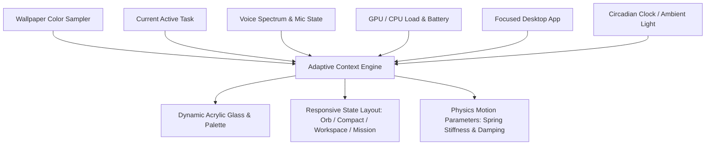
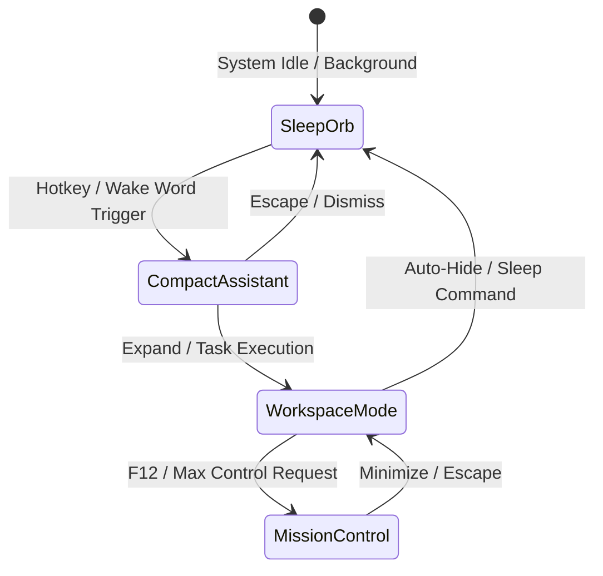
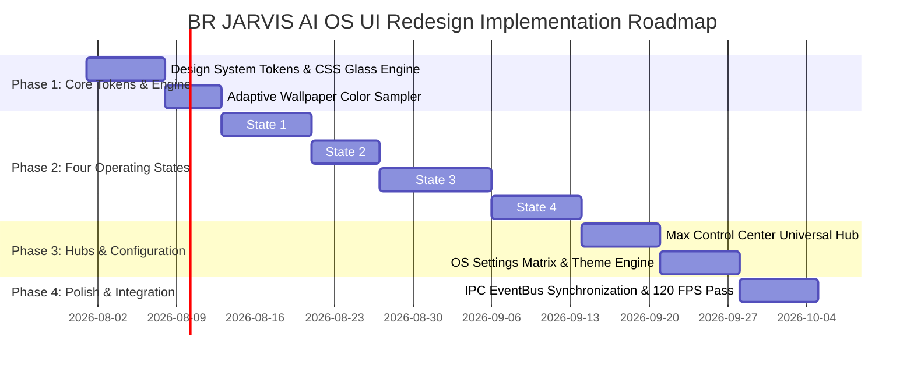

# B.R. JARVIS AI Operating System (AI OS) — Master UI/UX Redesign Specification

> **Lead Product Design & Systems Architecture Document**  
> *Target Architecture: Next-Gen Adaptive AI OS Interface (Tauri v2 / React / TypeScript / Framer Motion / Canvas Shaders / Windows DWM Acrylic)*

---

## 🏛️ 1. Vision & Identity

**BR JARVIS** is reimagined not as a software application or chatbot dashboard, but as a **living, adaptive, ambient AI Operating System**.

The interface operates under a foundational principle: **Ambient Availability with Zero Visual Clutter**. It appears precisely when required, adapts to context dynamically, and recedes into the background during deep human focus.

```
┌────────────────────────────────────────────────────────────────────────────────────────┐
│                                 DESIGN BENCHMARK MATRIX                                │
├──────────────────────────┬─────────────────────────────────────────────────────────────┤
│ Apple VisionOS           │ Spatial translucency, 3D depth layering, specular highlights│
│ Arc Browser              │ Fluid workspace routing, sidebar spaces, adaptive themes    │
│ Linear                   │ Micro-precision typography, ultra-fast keyboard ergonomics  │
│ Raycast                  │ Instant zero-friction Command Palette execution & extensions │
│ Warp Terminal            │ GPU-accelerated canvas rendering, block-based UI flow       │
│ Windows 11 Acrylic       │ Native window blur backdrop, DWM dark mode integration      │
│ Nothing OS               │ Minimalist glyph system, high-contrast monochrome accents  │
└──────────────────────────┴─────────────────────────────────────────────────────────────┘
```

---

## 🔄 2. Adaptive Context Engine (Core Design Philosophy)

The UI is never static. It evaluates a real-time **Context Matrix** every frame to compute UI layout, color temperatures, glass opacity, and animation velocity:



### Context Adaptation Rules
1. **Wallpaper Sampling**: Analyzes background wallpaper RGB histograms to derive ambient neon glow tints and dynamic glass contrast ratios.
2. **Task Adaptation**: Swaps workspace widgets based on active task domain (e.g. Code Editing triggers Vision Inspector & Log Terminal; Voice Assistant triggers Orb Equalizer).
3. **Circadian Shifts**: Transitions color temperatures smoothly from crisp cyan/blue (`6500K`) during daylight hours to warm amber/magenta (`3000K`) at night.

---

## 📱 3. The Four Primary UI Operating States



---

### State 1: Sleep Mode (Floating Orb)

The AI exists continuously as a high-density, magnetic floating glass orb.

#### Core Features:
- **Orb Graphics Pipeline**: Multi-layer canvas glass sphere rendered with a rotating halo ring, internal particle core, and dynamic radial aura.
- **Wake-Word Ambient Listening**: Visualizes ambient sound levels via soft outer aura ripples without disturbing user workflow.
- **Magnetic Screen Docking**: Drags fluidly with momentum physics; magnetically snaps to screen edges with auto-hide translucency (80% off-screen when inactive).
- **HUD Badges**: Displays subtle floating glyphs for notifications, active task counts, and system status indicators.

```
       .---.            <- Halo Ring (Rotating 0.2 rad/s)
     /   *   \          <- Floating Glass Sphere with Internal Particles
    |  (  ●  )  |       <- Core State Pulse (Green=Listening, Purple=Thinking)
     \   .   / 
       '---'            <- Dynamic Equalizer Ripple Base
```

---

### State 2: Compact Assistant (Floating Command Widget)

Triggered via wake-word or hotkey (`Alt + Space`), the Floating Orb morphs with a **250ms spring transition** ($k=300, d=28$) into a sleek floating widget.

#### Core Features:
- **Dimensions**: $480\text{px} \times 320\text{px}$ (resizable and draggable).
- **Elements**: Streamlined conversation transcript, audio waveform equalizer, quick action chips, mic toggle, stop button, and recent command history.
- **Context-Aware Clipboard**: Detects active clipboard content (URLs, code snippets, images) and offers 1-click execution chips.

---

### State 3: Workspace Mode (Modular AI OS Desktop)

A full multi-window modular workspace for productive human-AI pair execution.

#### Panel Grid System:
```
+-----------------------------------------------------------------------------------------------+
|  NAV BAR: [B.R. JARVIS OS v6.0]  [Spaces: 1 2 3]  [Model: Gemini 3.5]  [🎛️ Max Control] [⚙️] |
+-------------------------------+-------------------------------+-------------------------------+
|                               |                               |                               |
|  PANEL A: CONVERSATION STREAM |  PANEL B: PLANNER & DAG       |  PANEL C: COMPUTER OPERATOR   |
|  - Real-time event log        - Dynamic goal DAG tree         - Live screen canvas & OCR      |
|  - Multi-turn text/voice      - Active step progress          - Mouse/keyboard execution      |
|  - Structured Markdown        - Parallel agent workers        - Interactive element bounding  |
|                               |                               |                               |
+-------------------------------+-------------------------------+-------------------------------+
| PANEL D: SYSTEM & REASONING   | PANEL E: MEMORY TIMELINE      | PANEL F: TOOL ENGINE DOCK     |
| - GPU/CPU/RAM gauge bars      - Vector memory search          - Active plugins & skills       |
| - Token budget meter          - Chronological event graph     - Workspace file tree           |
+-----------------------------------------------------------------------------------------------+
```

- **Modular Drag & Dock**: Every panel can be detached into independent native windows, resized, docked, or collapsed into side tabs.
- **Auto-Saved Layouts**: Layout matrices are saved per task type (Coding, Research, Media, Control).

---

### State 4: Mission Control (Developer & Deep Audit Console)

Fullscreen telemetry and developer diagnostic environment (`F12` / `Ctrl+Shift+M`).

#### Features:
- **Event Bus Visualizer**: Real-time Node-Graph showing live message propagation across all 12 OS subsystems.
- **Reasoning Tree & DAG Graph**: Visualizes parallel LLM step expansion, branch scoring, and tool execution trees.
- **Memory Vector Inspector**: 3D spatial point-cloud of active vector memory embeddings and long-term storage retrieval nodes.
- **Live Vision Inspector**: Raw high-FPS screen capture overlay with dynamic bounding boxes, OCR text masks, and click target confidence scores.

---

## 🎛️ 4. Max Control Center (Universal Capability Hub)

Accessible via the primary HUD or shortcut (`Ctrl + Shift + C`), **Max Control Center** provides a single-level, zero-nested control grid covering every capability:

```
┌────────────────────────────────────────────────────────────────────────────────────────┐
│ 🎛️ MAX CONTROL CENTER — UNIVERSAL CAPABILITY MATRIX                                     │
├─────────────────┬──────────────────────────────────────────────────────────────────────┤
│ 🎙️ Voice         │ Speech engine tuning, Wake-word sensitivity, Voice clone profiles    │
│ 👁️ Vision        │ Screen capture FPS, OCR detection engine, Element highlight overlays │
│ 🧠 Memory       │ Vector DB status, Memory pruning, Archival search, Context reset     │
│ ⚡ Models        │ Provider router, Token budget limits, Ollama offline toggle, Quant   │
│ 🧩 Plugins       │ Skill loader, MCP server status, API key matrix, Custom webhooks    │
│ 🖥️ Operator      │ Mouse speed, Execution safety interlocks, Sandbox isolation policy  │
│ ⚙️ System        │ Windows DWM Acrylic, Dynamic accent color engine, Hardware GPU graph│
└─────────────────┴──────────────────────────────────────────────────────────────────────┘
```

---

## ⚙️ 5. OS Settings Architecture

A native, comprehensive Settings interface structured with tabbed navigation and deep customization options:

1. **Appearance & Aesthetics**:
   - Glass Transparency ($0.1 \rightarrow 0.95$), Acrylic Blur Radius ($0\text{px} \rightarrow 50\text{px}$).
   - Dynamic Wallpaper Color Adapter toggle.
   - Typography font selectors (`Segoe UI Variable`, `Inter`, `Cascadia Code`, `Fira Code`).
   - Animation velocity scale ($0.5x \rightarrow 2.0x$, or Reduced Motion).
2. **Voice & Acoustics**:
   - Wake-word selection ("Jarvis", "Computer", Custom).
   - Real-time STT / TTS engine selector (Whisper, EdgeTTS, ElevenLabs, System Native).
3. **AI Models & Router**:
   - Multi-backend prioritization engine (Gemini, Claude, GPT, Ollama, DeepSeek).
   - Token budget ceiling & monthly expenditure tracking.
4. **Safety & Permissions**:
   - System command execution interlocks, file write white-lists, redteam policy rules.

---

## 🎨 6. Design System Tokens & Glassmorphism Spec

### A. Color Token Engine

```css
:root {
  /* Surface & Base Colors */
  --os-bg: #04060a;
  --os-surface-glass: rgba(15, 22, 35, 0.65);
  --os-card-glass: rgba(22, 32, 50, 0.50);
  --os-card-hover: rgba(32, 45, 70, 0.70);
  
  /* Acrylic Borders & Shadows */
  --os-border-glass: rgba(255, 255, 255, 0.12);
  --os-border-glow: #00f2fe;
  --os-shadow-elevation: 0 20px 50px rgba(0, 0, 0, 0.6);

  /* Neon Chromatic Scale */
  --os-cyan: #00f2fe;
  --os-purple: #bf5af2;
  --os-pink: #ff2d55;
  --os-green: #30d158;
  --os-amber: #ff9f0a;
  --os-blue: #0088ff;

  /* Typography Scale */
  --font-sans: 'Segoe UI Variable', 'Inter', system-ui, sans-serif;
  --font-mono: 'Cascadia Code', 'Fira Code', monospace;
}
```

### B. Glassmorphism CSS Specification

```css
.glass-panel {
  background: var(--os-surface-glass);
  backdrop-filter: blur(24px) saturate(180%);
  -webkit-backdrop-filter: blur(24px) saturate(180%);
  border: 1px solid var(--os-border-glass);
  box-shadow: var(--os-shadow-elevation);
  border-radius: 16px;
  transition: all 0.25s cubic-bezier(0.16, 1, 0.3, 1);
}

.glass-panel:hover {
  border-color: rgba(0, 242, 254, 0.4);
  box-shadow: 0 0 30px rgba(0, 242, 254, 0.15), var(--os-shadow-elevation);
}
```

---

## ⚡ 7. Motion Graphics & Physics Micro-Interactions

Every interaction adheres to **Physical Motion Physics** using Framer Motion spring curves:

```typescript
// Framer Motion Spring Presets
export const OS_SPRINGS = {
  orbExpand: { type: "spring", stiffness: 300, damping: 28 },
  panelDock:  { type: "spring", stiffness: 400, damping: 35 },
  hoverGlow:  { duration: 0.18, ease: "easeOut" },
  statePulse: { repeat: Infinity, repeatType: "mirror", duration: 2.2, ease: "easeInOut" },
};
```

### Motion Feedback Rules:
- **No Spinner Loaders**: Thinking states use pulsing neural purple aura waves and particle aggregation.
- **Hover Micro-Elevations**: Hovering over cards scales them by $1.02\times$ with dynamic light reflection vectors.
- **Magnetic Snapping**: Windows snap to desktop edges with soft elastic bounce physics.

---

## 🚀 8. High-Performance Architecture (60–120 FPS Target)

```
┌────────────────────────────────────────────────────────────────────────────────────────┐
│                               PERFORMANCE OPTIMIZATION MATRIX                          │
├──────────────────────────┬─────────────────────────────────────────────────────────────┤
│ Render Layer Separation  │ UI Layout in DOM/React; Particle Engine & Orb in WebGL Canvas │
│ List Virtualization      │ TanStack Virtual for 10,000+ line event logs and memory trees │
│ Component Rerenders      │ Zustand atomic selectors; Zero root state re-renders        │
│ Native Window Blur       │ Windows DWM HWND Blur API (`DwmSetWindowAttribute`)         │
└──────────────────────────┴─────────────────────────────────────────────────────────────┘
```

---

## 🛠️ 9. Technology Stack & Implementation Architecture

```
                               ┌────────────────────────────────┐
                               │     Tauri v2 / Electron OS      │
                               └──────────────┬─────────────────┘
                                              │
                       ┌──────────────────────┴──────────────────────┐
                       ▼                                             ▼
        ┌──────────────────────────────┐              ┌──────────────────────────────┐
        │  React 19 Frontend UI        │              │  Python Core Subsystems      │
        │  - TypeScript v5.5           │              │  - EventBus IPC Bridge       │
        │  - Tailwind CSS v4           │ ◄──────────► │  - Vision Engine & OCR       │
        │  - Framer Motion v11         │  WebSocket   │  - Computer Operator         │
        │  - Radix UI Primitives       │  / Async IPC │  - Multi-Backend Router      │
        │  - Three.js / WebGL Orb      │              │  - Memory Vector DB          │
        └──────────────────────────────┘              └──────────────────────────────┘
```

---

## 📂 10. Recommended Frontend Directory Hierarchy

```
frontend/
├── src/
│   ├── assets/
│   │   ├── shaders/        # WebGL Canvas Shader code for Orb & Particles
│   │   └── icons/          # System Glyph library
│   ├── components/
│   │   ├── core/           # GlassPanel, OrbVisualizer, WaveformEqualizer
│   │   ├── states/         # SleepOrb, CompactAssistant, WorkspaceGrid, MissionControl
│   │   ├── max_control/    # MaxControlCenter Modal & Category Grids
│   │   └── settings/       # SettingsModal & Configuration Tabs
│   ├── context/            # AdaptiveContextEngine provider & wallpaper sampler
│   ├── hooks/              # useVoiceState, useTelemetry, useKeyboardShortcuts
│   ├── stores/             # Zustand atomic stores (uiStore, agentStore, settingsStore)
│   └── styles/             # design-tokens.css, glassmorphism.css
├── package.json
└── tauri.conf.json
```

---

## 📋 11. Implementation Roadmap



---

> *Master AI OS Specification prepared by the Lead Product Designer & Principal UI Architect for B.R. JARVIS.*
