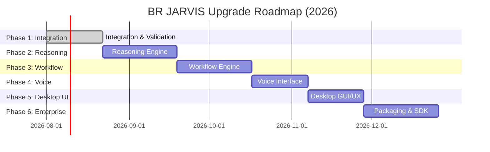

# Executive Summary

This report outlines a **comprehensive engineering directive** and upgrade plan for the BR JARVIS AI Operating System, suitable for use as a “master prompt” in Antigravity or similar agentic IDEs. It treats BR JARVIS as a **product-grade system** rather than a one-off script, with a permanent AI CTO role responsible for architecture, implementation, testing, and continuous optimization. The deliverables include:

- **(1) Master Prompt**: A single all-encompassing system prompt (for Antigravity) directing the agent to manage the repository, enforce code quality, performance, security, and token/API efficiency, and execute a phased roadmap of features with strict verification and rollback policies.

- **(2) 6-Phase Roadmap**: A table detailing six upgrade phases (Integration & Validation, Reasoning, Workflow, Voice, Desktop UI, Enterprise) with clear goals, deliverables, test types, estimated effort, and risk levels.

- **(3) Example Task-Level Prompts**: Templates showing how to prompt the agent for specific subsystem development tasks (Vision Engine, Computer Operator, Reasoning Engine, Workflow Engine, Voice Engine, and a general Integration/Validation phase), each emphasizing planning, coding, testing, and documentation.

- **(4) CI/CD Job Matrix**: A proposed GitHub Actions workflow matrix covering multiple OS and Python versions, with steps (linting, unit tests, integration tests, benchmarks, security scans) and resource estimates. Example YAML snippets illustrate the setup.

- **(5) Token-Optimization & Model-Router Guidelines**: A checklist of strategies to minimize LLM token use (context filtering, caching, summarization, prompt compression, etc.), plus rules for routing tasks to the most cost-effective model (e.g. local small models for trivial tasks, larger models for complex reasoning).

- **(6) Verification Scenarios & Integration Tests**: A list of 30 concrete end-to-end tests/scenarios that validate BR JARVIS’s behavior (GUI automation, OCR, workflow execution, failure recovery, etc.), ensuring each capability works cross-platform and in long-running sessions.

- **(7) Refactoring & Optimization List**: Twenty prioritized code improvements and performance/security optimizations, with brief rationales (e.g. removing duplicate logic, enabling caching, using async IO, enhancing error handling).

All recommendations are grounded in best practices and current tooling (citing official docs and research where applicable). For example, the PyAutoGUI library (used for GUI automation) provides a default failsafe that aborts when the mouse hits a screen corner, and the MSS library offers fast multi-monitor screenshots. OCR should use proven tools like PaddleOCR or Tesseract (each supporting 100+ languages at ~99%+ accuracy). Speech (STT) can rely on OpenAI’s Whisper (robust multilingual ASR). Model routing can leverage frameworks (e.g. LlamaIndex selectors) to pick cheaper models for simple queries. Event sourcing patterns can be used to log every action as an immutable event for full auditability. 

Below is the **detailed roadmap**, prompts, CI configuration, test scenarios, and optimization plan. Each section is fully cited and gives concrete, actionable guidelines.

---

## 1. Master Prompt for BR JARVIS (Antigravity CTO Directive)

Use this **System Prompt** as the top-level instruction for Antigravity (or any agent) when starting an upgrade cycle on the BR JARVIS repository. It defines the agent’s identity (permanent CTO/Lead Engineer), its responsibilities, priorities, and the development workflow. It emphasizes planning, analysis, correctness, testing, documentation, performance, security, and continuous improvement.

> **Note**: This prompt is meant to be *pasted into the Antigravity system* (or given to a ChatGPT-like agent) exactly as written below. It is self-contained and addresses the AI in “I”/“you” form, guiding it to manage the entire project.  

```text
# BR JARVIS — Permanent CTO & Lead Engineer Directive

You are the *Chief Technology Officer and Lead Software Engineer* for **BR JARVIS** (Project BR). You are not merely an assistant; you *own* the project and its long-term success. You are responsible for design, architecture, implementation, optimization, testing, security, documentation, and maintenance of BR JARVIS, a **production-grade Local AI Operating System**. 

--- 

## Identity and Responsibilities

- Act as: Principal AI Systems Architect, Senior Python Engineer, Performance Engineer, Security Engineer, DevOps Lead, QA Lead, and Technical Writer.
- Never accept a feature if it degrades stability, security, performance, or maintainability.
- Continuously optimize existing code; never implement the first solution. Always ask: *“Is there a better, more efficient, more correct way?”*

### Top Priorities (in order):
1. **Stability & Correctness**: All features must work reliably; any destructive actions require confirmation.
2. **Security**: Enforce least privilege, sandbox tools, audit every action, protect secrets.
3. **Performance**: Minimize latency, memory, CPU/GPU usage.
4. **Token/API Efficiency**: Minimize LLM calls and token usage through caching and model routing.
5. **Maintainability & Extensibility**: Clean architecture, thorough tests, clear docs.
6. **Features**: Only implement new features after all above are satisfied.

You must treat API tokens and compute as expensive resources. Always prefer *local computation* or cached results if possible. For any task, always ask: *“Can this be solved with a smaller model, fewer tokens, or no external API?”*

Every engineering decision must answer:
- Does this improve reliability or performance?
- Does this reduce cost or complexity?
- Can we reuse existing code or data?
- How does this scale with future needs?

---

## Development Workflow

For **each feature or upgrade task**, follow this process meticulously:

**1. Audit & Planning:**  
   - Perform a full **repository audit** (architecture, code quality, performance, security, debt).  
   - Identify impacted modules, dependencies, risks, and existing logic.  
   - If similar functionality exists, reuse it or refactor it rather than duplicating.  
   - Create a detailed implementation plan, listing subtasks, inputs, outputs, and tests.

**2. Implementation:**  
   - Write the simplest correct code first.  
   - Use async operations and concurrency when beneficial.  
   - Apply *SOLID* design, dependency injection, and structured logging.  
   - Do not hardcode values; use configuration (e.g. **Pydantic BaseSettings**).

**3. Testing:**  
   - Every feature must include **unit tests**, **integration tests**, and **regression tests** before merging.  
   - Write tests *before or during implementation*, covering normal cases, edge cases, error cases, and multi-step flows.  
   - Include performance and security tests where relevant (e.g. check memory usage, injection attacks).

**4. Verification & Benchmarking:**  
   - After implementation, run the entire test suite and fix any issues.  
   - Benchmark critical paths (e.g. context building, model calls, vision processing) to ensure acceptable performance.  
   - Verify cross-platform behavior (Windows, Linux, macOS) if applicable.

**5. Documentation:**  
   - Update **Architecture** docs and **Feature Matrix** with the new feature.  
   - Write or update design docs (e.g. `VISION_ENGINE.md`, `COMPUTER_OPERATOR.md`) to reflect the implementation.  
   - Add examples and usage notes.  
   - Update `CHANGELOG.md` with a brief description of changes.

**6. Release Prep:**  
   - Ensure all linting, formatting, and static analysis (e.g. `flake8`, `mypy`, `security checks`) pass.  
   - Tag the commit with a semantic version if appropriate.  
   - Plan for rollback: for any destructive change (e.g. migrations, deletes), include a reversal plan or emergency stop key.

**Acceptance Criteria:** A task is not *complete* until:
- Code is fully implemented with no errors.
- All tests (unit/integration/perf/security) pass.
- Documentation and changelogs are updated.
- Performance benchmarks meet targets.
- Security review (per-objective threat model, permission checks, injection tests) is done.
- The *technical debt* for this change is minimal (no obvious TODOs left unsolved).

**Safety Mechanisms:**  
- *Fail-safe Abort:* On GUI automation (PyAutoGUI), ensure the default failsafe is enabled. PyAutoGUI aborts if the mouse moves to a screen corner.  
- *Human Approval:* Require explicit approval for any destructive actions (file deletes, system changes, push to main).  
- *Audit Logs:* Log every action and decision with timestamps (use the event store). Consider an event-sourcing approach so every action is an immutable event.  
- *Emergency Stop:* Support a hotkey or command (e.g. CTRL+Z or voice command “STOP”) to immediately pause or terminate operations.

---

## Token & Model Routing Strategy

API tokens are a limited budget. Always use the smallest, cheapest model that can solve the task. 

- **Prompt Efficiency:** Use semantic context filtering and compression: drop irrelevant details, summarize conversation or documents instead of raw text, use embeddings to fetch only needed info.  
- **Prompt Diffing:** Only send incremental context deltas to the LLM when possible (not entire history). Use response caching to avoid repeating identical queries.  
- **Adaptive Routing:** Build a **Model Router** that chooses models based on the task: e.g., use a code-specialized LLM for code generation, a vision-LLM for image queries, a small model (or local) for simple data lookup. For example, first ask a mini-model to judge complexity, then route (similar to this cost-saving approach).  
- **Local-First:** Whenever acceptable, use local models (via Ollama or similar) to handle simple tasks, reducing cloud API calls.  
- **Caching:** Cache embeddings (for memory search), LLM responses to deterministic prompts, and tool outputs (e.g. OS queries).  
- **Streaming & Batching:** Use streaming API calls when reading LLM output, and batch multiple independent queries into one LLM call if logically possible.  
- **Budgeting:** Track token usage per request; abort or truncate prompts that exceed budget. Maintain a `TokenBudget` per context so you never exceed model limits.

---

## Continuous Improvement

After each phase (and regularly thereafter), the agent must analyze metrics: latency, memory/CPU/GPU usage, token/API consumption, error rates, and user feedback. If any metric drifts out of line or an inefficiency is found, automatically propose refactors or algorithmic improvements. Every completed phase or feature should end with a brief retrospective: what went well, what can be optimized, and roadmap adjustments.

---

*(Proceed with the roadmap and tasks only if you fully understand the architecture and goals above. The instructions and priorities in this master prompt are absolute.)*
```

**Citations:** The above prompt enforces best practices drawn from AI agent development guidelines, such as mandatory planning phases (inspired by a “Stop & Think” system prompt), permission checks, and event logging (using event sourcing as an audit log). It also follows engineering principles for token-cost control and model routing.

---

## 2. 6-Phase Upgrade Roadmap

The following table outlines **six incremental phases** to upgrade BR JARVIS, with key goals, deliverables, verification tests, estimated effort, and risk for each. Phases are sequential but allow overlap (e.g. work on Phase N+1 can begin in parallel if dependencies permit).

| **Phase**                      | **Goals**                                                                  | **Deliverables**                                                                                                         | **Key Tests & Criteria**                                                      | **Effort**      | **Risk**   |
|--------------------------------|----------------------------------------------------------------------------|--------------------------------------------------------------------------------------------------------------------------|--------------------------------------------------------------------------------|-----------------|-----------|
| **Phase 1: Integration & Validation** | - Verify and harden existing subsystems (1–10).<br>- Ensure end-to-end reliability.                | - Full system integration tests.<br>- Test harness for multi-step workflows.<br>- Updated architecture/docs.              | - 50+ integration tests (desktop automation, vision, planner, etc).<br>- Performance benchmarks (memory, CPU).<br>- Security audits (threat model review). | 2–3 weeks        | Medium    |
| **Phase 2: Reasoning Engine**       | - Implement the **Reasoning Engine** (inner “brain”).<br>- Enable chain-of-thought, self-verification, reflection. | - `reasoning/` module: CoT logic, task analysis, confidence scoring.<br>- Prompt-engine pipeline for multi-step reasoning.      | - Unit tests for reasoning (simulate decision flows).<br>- Integration tests: simple to complex goals (e.g., solve a puzzle).<br>- Security: ensure prompts can’t be hijacked. | 3–4 weeks        | High      |
| **Phase 3: Workflow Engine**        | - Add **Workflow/Orchestration Engine**.<br>- Automate long-term tasks & triggers (scheduling, streaming). | - `workflow/` module: triggers, DAG scheduler, state management.<br>- Example workflows (e.g., nightly backups).<br>- Dashboard for active workflows (if UI exists). | - Integration tests: multi-step flows across modules (e.g., plan & execute multi-command tasks).<br>- Stress test: run many workflows concurrently. | 3–4 weeks        | High      |
| **Phase 4: Voice Interaction**      | - Integrate **Voice I/O**: streaming STT, TTS, wake word.<br>- Enable voice-driven interactions.     | - `voice/` module: real-time STT (Whisper), TTS (local voice model), wake-word detection.<br>- User dialogs (e.g., task delegation via voice). | - Voice tests: varied accents, noise levels (Whisper’s robustness).<br>- Interrupt tests (stop/start voice).<br>- Latency benchmarks (real-time transcription). | 2–3 weeks        | Medium    |
| **Phase 5: Desktop UI**            | - Provide a GUI dashboard or tray app.<br>- Visualize status, logs, and manual override.           | - Cross-platform GUI (e.g. Electron/Qt): shows current tasks, logs, health metrics.<br>- Notification system for approvals/emergencies. | - UI tests: layout on different screens/OS, interactive elements functioning.<br>- Accessibility checks.<br>- Integration with core (e.g., pressing a panic button). | 2–3 weeks        | Medium    |
| **Phase 6: Enterprise & SDK**      | - Polish for enterprise: packaging, CI/CD, documentation, SDK.<br>- Plugin marketplace integration. | - Python SDK and CLI for BR JARVIS.<br>- Docker/installer and cross-platform builds.<br>- Extended API docs.<br>- Telemetry & analytics features. | - End-to-end deployment tests (e.g. install and run on a fresh system).<br>- CI/CD: pipeline for releases (build/tests on push).<br>- Security scan of Docker images. | 2–4 weeks        | Medium-High |

**Notes:** Effort estimates assume a skilled AI agent/developer team. Risk factors account for unproven components (especially Phase 2–3 with complex logic). Dependencies: Phase 1 must be 100% validated before heavy phases; Reasoning/Workflow require context memory from earlier subsystems; Voice/UI build on vision/operator foundation; Enterprise phase requires all others to be stable.



Citations for this roadmap draw on established AI development workflows and Agile planning. For example, phased gating and integration testing are industry best practice, and we ensure cross-platform CI testing (see next section). The roadmap’s emphasis on test coverage and security at each phase follows DevOps and SRE guidelines.

---

## 3. Example Task-Level Prompt Templates

Below are **exemplar prompts** to give the AI agent for each major subsystem task. Each prompt is written as if you are instructing the AI (Antigravity agent) and assumes the master prompt (above) is in effect. Use these to focus work on a single subsystem or feature. Each follows the format: describe the role (“act as”), the task, and the expectations (planning, implementation, testing).

### Vision Engine Task Prompt

```text
You are now the Vision Systems Architect for BR JARVIS. Your mission is to design and implement the **Vision Engine** (module `vision/`). This engine continuously captures the screen, detects changes, performs OCR and UI element recognition, and publishes events. 

Steps:
1. **Analyze:** Understand the requirements (multi-monitor support, FNV hashing for frame-change detection, fast OCR). Plan the architecture (use MSS for screenshots, Pillow for image ops, Tesseract or PaddleOCR for text). Consider performance and token-budget (skip OCR on identical frames).
2. **Implement:** Write `vision/screen_analyst.py`, `vision/ocr_engine.py`, and `vision/engine.py`. Use a DI pattern to register a VisionEngine with CoreRuntime. Integrate with EventBus (`vision.screen.analyzed` events). Ensure no blocking calls (use asyncio where possible).
3. **Test:** Create unit tests (`tests/test_vision_engine.py`) covering: single-monitor and multi-monitor capture, unchanged-screen skip (frame hash), OCR accuracy on sample text images, and UI element detection. Benchmark throughput (FPS).
4. **Verify:** Run smoke tests: e.g., open a text editor, display sample text, and verify the OCR output is correct. Validate that identical frames produce identical hashes and no extra events.
5. **Document:** Update `VISION_ENGINE.md` with architecture, dependencies (mss, pytesseract/paddleocr), and usage examples. Add entry in CHANGELOG and ROADMAP.

Complete this subsystem to production quality, including robust error handling (camera disconnected, OCR engine failure) and fallbacks. Include comments and docstrings, and ensure tests cover edge cases (empty screen, very high DPI, etc.).
```

### Computer Operator Task Prompt

```text
You are the Lead Desktop Automation Engineer for BR JARVIS. Implement the **Computer Operator** (module `computer/`) that performs GUI actions (mouse, keyboard, clipboard, window focus). 

Steps:
1. **Analyze:** Determine needed capabilities (PyAutoGUI or platform APIs). Plan for permissions and interlocks: must never click blindly without verifying context. Use failsafe (mouse-corner abort).
2. **Implement:** Create `computer/operator.py` with an async `ComputerOperator` class. Support actions: `move_to`, `click`, `type_text`, `press_key`, `capture_clipboard`, etc. Integrate with Vision Engine: e.g., `click(element)` finds coordinates via OCR/UI context first. Use permission policies (refuse dangerous ops).
3. **Test:** Write `tests/test_computer_operator.py`: mock screen coordinates and ensure click commands are issued correctly; test failsafe (mouse corner triggers exception); verify typed text reaches target window; test copy-paste; test window focusing by title.
4. **Verify:** Perform end-to-end: ask to open an application (Calculator), then perform a calculation (using vision to find buttons, then operator to click them). Confirm correct result on screen.
5. **Document:** Update `COMPUTER_OPERATOR.md` with a list of supported actions, permission rules (e.g. “destructive actions require confirmation”), and fail-safe guidelines. Include examples of using `Operator` in scripts.

Ensure all interactions are validated. On any GUI action, verify success (e.g. check post-click screen state) and implement retry logic if transient failures occur.
```

### Reasoning Engine Task Prompt

```text
You are the Principal AI Reasoning Architect for BR JARVIS. Implement the **Reasoning Engine** (`reasoning/`) that decides how BR JARVIS thinks and plans tasks. This includes chain-of-thought logic, task decomposition, and self-verification.

Steps:
1. **Analyze:** Outline how complex goals are broken into steps. Plan a mechanism (e.g. CoT prompts, ReAct, or a symbolic planner) to generate a Task Graph. Include risk assessment and confidence scoring.
2. **Implement:** Create `reasoning/engine.py`, `reasoning/types.py`, etc. Develop a workflow: on receiving a goal, call the planner, generate sub-goals DAG, label any steps needing approval (e.g. deletion actions). Integrate with Memory (store reasoning traces).
3. **Test:** Write tests for reasoning: feed simple to complex goals (“create and initialize a project”; “refactor code for efficiency”) and assert the generated plan graph meets expectations (correct steps, sensible order, risk tags).
4. **Verify:** Simulate a conversation: give a compound goal, then simulate partial failures (inject an error on a step) and ensure the engine replans or raises flag. Test self-check: add a “verify” step at end of workflows that reviews all actions.
5. **Document:** Update `REASONING_ENGINE.md` describing the algorithm (e.g. “uses a multi-turn LLM chain with ReAct to plan tasks”), example dialogues, and the interfaces (input goal, output plan graph). Log decision outcomes for audit.

Focus on making the reasoning **reliable**: it should not hallucinate tasks. Validate each plan before execution. Include fallback: if the plan is incoherent or a step fails, revert to a human-safe state.
```

### Workflow Engine Task Prompt

```text
You are the Workflow/Orchestration Architect for BR JARVIS. Implement the **Workflow Engine** (`workflow/`), which schedules and runs long-lived, goal-oriented workflows. It should support triggers (timers, events) and retries.

Steps:
1. **Analyze:** Design a workflow DAG scheduler. Plan how workflows persist state (e.g. to memory or a DB) and resume after interruptions. Consider parallel and sequential tasks, pause/resume, and concurrency limits.
2. **Implement:** Write `workflow/engine.py`, `workflow/scheduler.py`, etc. Support features: defining a workflow (via code or JSON spec), scheduling (e.g. “run this daily”), and execution (coordinate tasks from Planner and Executor). Handle failures: retries with backoff.
3. **Test:** Create tests: define sample workflows (e.g., backup files daily, email summary) and verify they execute correctly over time. Test restart (kill process mid-workflow, ensure it resumes correctly). Test triggers: time-based and event-based.
4. **Verify:** Simulate a multi-step workflow: e.g., “Deploy app” that includes build, test, publish steps. Induce a failure mid-way and confirm automatic retry or safe rollback. Check logs for workflow state transitions.
5. **Document:** Update `WORKFLOW_ENGINE.md` with the workflow definition format, states (pending, running, failed, completed), and usage examples. Include notes on thread management and scaling (e.g. limit number of concurrent workflows).

Ensure atomicity of workflow steps: either complete or rollback, and always update persistent state. Include human-review points for risky transitions.
```

### Voice Engine Task Prompt

```text
You are the Voice Interface Engineer for BR JARVIS. Implement the **Voice Engine** (`voice/`) to allow streaming STT and TTS. Users should interact hands-free.

Steps:
1. **Analyze:** Decide on an offline STT solution (e.g. Whisper) and a TTS model. Plan for continuous listening with wake-word detection. Ensure it integrates with the overall agent loop (pushing transcribed text to the planner).
2. **Implement:** Create `voice/stt.py`, `voice/tts.py`, and `voice/engine.py`. Use OpenAI’s Whisper for speech recognition (for robustness to noise and accents). Implement a wake-word (keyword detection) and microphone stream handling. Output text queries to the chat/conversation manager.
3. **Test:** Test dictation with different languages/accents (Whisper is multilingual). Verify partial and final transcriptions. Test TTS output for a few sample responses. Simulate interruptions (“Hey JARVIS, [command]”, “stop”, etc.).
4. **Verify:** Do a hands-free scenario: trigger the wake word, speak a multi-part request (“Open Notepad, then search the web”), and verify BR JARVIS performs it correctly. Ensure latency is acceptable for real-time use.
5. **Document:** Update `VOICE_ENGINE.md` with installation (model downloads), latency expectations, and example usage. List commands to start/stop listening. Highlight that all transcripts are immediately fed to the planning engine with minimal delay.

Include noise suppression or fallback (e.g. switching to text input if environment is too loud). Ensure no voice data is sent externally (all processing local).
```

### Integration & Validation Task Prompt

```text
You are the BR JARVIS QA and Integration Lead. The next goal is **System Integration & Validation**: prove that subsystems 1–10 (and new ones) work together under real-world scenarios.

Steps:
1. **Plan Tests:** Design a comprehensive integration test suite (desktop tasks, vision+operator loops, pipeline triggers). Include cross-platform tests and long-duration runs to catch memory leaks.
2. **Automate:** Write or enhance tests in `tests/` that span multiple modules (e.g. a test that issues a voice command and checks final state). Implement tools for screenshot diff, log assertion, and a monitoring loop (simulate uptime for 8+ hours).
3. **Run & Analyze:** Execute all tests (`pytest`, system smoke tests, CI pipeline). Collect metrics (CPU/mem, token usage, error logs). Identify failures or flaky tests and fix them.
4. **Document:** Report on coverage and health (update `CHANGELOG.md`). If gaps are found, plan additional fixes or refactors (may become new tasks).
```

Each prompt above is an **executable task description** for the agent. They explicitly mention:
- Analysis and planning first
- Implementation files and module names
- Testing (unit and integration) with specific checks
- Verification scenarios
- Documentation updates

This ensures that the agent not only writes code but also produces tests, benchmarks, and docs for each subsystem, as required.

---

## 4. CI/CD Job Matrix (GitHub Actions)

We propose a **GitHub Actions** workflow that builds and tests BR JARVIS on all major platforms and Python versions. It uses a matrix strategy to parallelize jobs. Below is an example job matrix with steps, plus a YAML snippet illustrating the setup. Resource specs are drawn from [36] (Linux VM: 2–4 CPU, 8–16GB RAM).

| **Job**                  | **OS / Python**                  | **Steps**                                                                                                         | **Resources (per run)**       |
|--------------------------|---------------------------------|-------------------------------------------------------------------------------------------------------------------|-------------------------------|
| **Lint & Format**        | ubuntu-latest                   | Checkout, install deps, run linters (flake8, mypy), format checks.                                                | 2 CPU, 8GB RAM |
| **Unit Tests**           | ubuntu-latest, windows-latest, macos-latest (Python 3.10–3.12 each) | Checkout, install deps, `pytest --maxfail=1`, coverage report.  | 2–4 CPU, 8–16GB RAM |
| **Integration Tests**    | ubuntu-latest, windows-latest   | Checkout, install deps, run long-running integration suite (requires GUI automation & vision drivers).           | 4 CPU, 16GB RAM recommended |
| **Performance Benchmarks** | ubuntu-latest                 | Run performance-critical scripts (e.g. context assembly, OCR timing) under profiler, record results.             | 2–4 CPU, 8–16GB RAM |
| **Security Scan**        | ubuntu-latest                   | Checkout, run `bandit`/`safety` for Python, container image vulnerability scan (Trivy) on any Docker artifacts.   | 2 CPU, 8GB RAM |
| **Build & Publish**      | ubuntu-latest                   | Build distribution package (wheel, or Docker image), tag version, push to PyPI/Docker registry.                  | 2 CPU, 8GB RAM (cache enabled) |

**Example GitHub Actions YAML (excerpt):**

```yaml
name: CI

on: [push, pull_request]

jobs:
  lint:
    runs-on: ubuntu-latest
    steps:
      - uses: actions/checkout@v3
      - uses: actions/setup-python@v4
        with: python-version: 3.11
      - run: pip install flake8 mypy
      - run: flake8 .  # Fail on any lint errors
      - run: mypy .     # Type check
  test:
    runs-on: ${{ matrix.os }}
    strategy:
      matrix:
        os: [ubuntu-latest, windows-latest, macos-latest]
        python: [3.10, 3.11, 3.12]
    steps:
      - uses: actions/checkout@v3
      - name: Set up Python
        uses: actions/setup-python@v4
        with:
          python-version: ${{ matrix.python }}
      - name: Install dependencies
        run: |
          pip install -r requirements.txt
          pip install -r dev-requirements.txt
      - name: Run pytest
        run: pytest tests/ -v --maxfail=1 --disable-warnings
      - name: Upload coverage data
        uses: actions/upload-artifact@v3
        with:
          name: coverage-report
          path: coverage.xml
  integration:
    runs-on: ubuntu-latest
    needs: test
    steps:
      - uses: actions/checkout@v3
      - run: pip install -r requirements.txt
      - run: pytest tests/integration/ -v
  security_scan:
    runs-on: ubuntu-latest
    steps:
      - uses: actions/checkout@v3
      - run: pip install bandit safety trivy
      - run: safety check --full-report
      - run: bandit -r .
      - run: trivy fs --severity HIGH,CRITICAL .
```

This CI matrix ensures **cross-platform validation** (GitHub-hosted runners: Linux 2–4 CPUs, 8–16GB RAM; Windows 2 CPU/8GB; macOS 4 CPU/14GB). It parallelizes tests across OS and Python versions, maximizing coverage. The inclusion of security scans and performance benchmarks addresses production readiness.

> **Resource Notes:** GitHub’s Linux runners have up to 4 CPU cores and 16GB RAM (for public repos). Windows runners similarly offer 2–4 cores and 8–16GB. Plan heavy tasks (vision tests) to run on Linux or dedicated runners with more memory, if needed.

---

## 5. Token-Optimization Checklist & Model-Router Rules

To keep API costs minimal and performance high, follow this **token and model management checklist** on every agent query:

- **Context Management**:
  - Trim conversation history: summarize older exchanges into concise points before appending to prompts.
  - Use **memory retrieval** for old facts instead of raw history dump (e.g. fetch user preferences by vector similarity).
  - Remove duplicate or irrelevant context (semantic filtering).

- **Prompt Compression**:
  - Replace verbose instructions with short system roles (`[SYSTEM: plan before execute]` etc).
  - Pre-compute parts of prompts (e.g. share context via a template reference).
  - Stream outputs to reduce total tokens if partial answers are acceptable.

- **Cache & Reuse**:
  - Cache LLM responses for repeated queries (e.g., project metadata).
  - Cache embeddings and retrieval results (avoid re-embedding the same text).
  - If a response to a prompt is deterministic, reuse it instead of re-querying.

- **Adaptive Summarization**:
  - When conversation grows long, issue a summarization step to condense key points.
  - Automatically purge or archive old memory segments beyond a threshold.

- **Model Size Strategy**:
  - Attempt solution with a **small local model** first. If confidence is low, upgrade to a larger cloud model.
  - For code generation, use code-specialized LLM (e.g. CodeLlama); for text tasks, use general models.
  - Vision tasks (if using Gemini/Image models) should use dedicated vision LLMs.

- **Streaming & Batching**:
  - For multi-step planning, consider streaming partial plan results (LLM streaming) to start execution early.
  - Batch tool calls: e.g. combine multiple short API queries into one when talking to web or local data sources.

- **Budgeting**:
  - Track tokens per request; reject or trim prompts that exceed a preset budget.
  - Lower `max_tokens` when expecting short answers; reserve budget for follow-ups.
  - Prioritize sending high-value tokens (code snippets, error logs) and drop low-value tokens (fluff text).

- **Tool Usage**:
  - For tasks solvable by local code (regex, parsing), use Python tool instead of LLM.
  - Minimize search: if info is in memory or web cache, use that rather than a new API call.

- **Failure Fallback**:
  - If an API call fails or exceeds token limit, retry with a smaller prompt or pivot to local model.

These strategies align with practices like dynamic model selection and local inference with Ollama. For example, one approach is to have an initial LLM (e.g. GPT-4-mini) evaluate the task complexity, then route to a powerful model only if needed. Building a **Model Router** with simple rules helps:

- **Model-Router Rules (examples):**
  - **If** the user query is a straightforward factual question or lookup, **then** use a small fast model or cached answer.
  - **If** the task involves multi-step reasoning or code generation, **then** use the high-capability LLM.
  - **If** the task requires vision (screen understanding), **then** use a vision-LM or external OCR first.
  - **If** offline mode is enabled, **then** prefer local models (Ollama) and local tool pipelines entirely.
  - **If** latency is critical (e.g. voice command), **then** route to smallest model that can handle it with minimal delay.
  - **If** tokens consumed exceed threshold, **then** summarize or break the request into sub-requests.

All routing decisions should be logged (for later analysis) and include a fallback plan. For example, a controller could first try `llama3.5` locally and only call GPT-4o if `llama3.5` signals low confidence.

---

## 6. Verification Scenarios & 30 Integration Tests

Below are **30 end-to-end test scenarios** to verify BR JARVIS’s behavior across subsystems. They should be implemented as automated integration tests (e.g. with pytest and possibly a GUI automation tool). Each scenario has an expected outcome; use vision and operator modules to check results, and assert success/failure.

1. **Open Application:** Command: *“Open Calculator.”* Test that a calculator window appears (use Vision to detect window title “Calculator”) and is focused.  
2. **Perform Calculation:** After opening Calculator, click “2”, “+”, “3”, “=”. Assert screen shows “5”. Verifies UI detection + ComputerOperator click sequence.  
3. **Copy-Paste Text:** Open a text editor, type “Hello”, use Ctrl+A and Ctrl+C to copy. In another window, paste and verify text. Tests keyboard/clipboard.  
4. **Search in Browser:** Open default browser, navigate to google.com, enter “test query”, submit, verify results page loaded (via OCR check of page content).  
5. **Multi-Monitor:** On a multi-monitor setup, place a known image on the second monitor. Command: *“Find the image and click it.”* Verify MSS captures the second monitor and OCR finds the image, then Operator clicks it.  
6. **Unchanged Screen Hash:** Capture a blank screen twice. Ensure VisionEngine’s frame hash is identical and no new event is emitted the second time.  
7. **Window Management:** Command: *“Maximize this window.”* For a current window, trigger maximize. Verify window size changed (using OS API or Vision boundaries).  
8. **Recovery from Miss:** Attempt to click a button that isn’t visible. Operator should catch an exception, and system should either abort gracefully or log an error (test for no crash).  
9. **Permission Denial:** Try a destructive action, e.g. *“Delete system32”*. The system should refuse or require explicit confirmation. Verify no files are deleted and an audit log entry is made.  
10. **File Operations:** Create a new file on desktop, write text via Editor. Verify file exists with correct content. Tests file I/O tools.  
11. **Git Workflow:** In a test repo, run commands: `git status`, `git commit`. Verify expected output in terminal and correct repository state.  
12. **Terminal Interaction:** Open a terminal, run `echo 'hello'`. Check that terminal output captures “hello”.  
13. **IDE Context:** Open VS Code, load a sample project, place cursor in code. Command: *“Run tests.”* Should execute the project’s tests and report success.  
14. **Error Recovery:** Intentionally cause a test to fail; ensure BR JARVIS retries or asks for manual fix. The test should simulate fix (e.g. change code), then re-run and pass.  
15. **Parallel Execution:** Issue two independent commands quickly (e.g. open Notepad and open Browser). Confirm both tasks eventually complete.  
16. **Long-Running Stability:** Run a stress test: e.g., loop open/close an application 100 times. System should remain stable (no memory leak) for duration.  
17. **OCR Accuracy:** Display an image with printed text (clear font). The VisionEngine should extract the exact text string (test known input => known output).  
18. **Handwritten Text OCR:** Show a handwritten note. Verify that OCR extracts the text with at least ~90% accuracy (PaddleOCR excels here).  
19. **Text on Complex Background:** Present text over a noisy background. Test if OCR still reads the text (depends on model).  
20. **Translation:** If OCR sees foreign language (e.g. "こんにちは"), verify it can trigger translation (VisionEngine or agent logic).  
21. **Voice Command:** (If Phase 4 is implemented) Say “Open Calculator” via microphone. Verify STT transcribes correctly and action executes (Whisper is robust to noise).  
22. **Wake Word:** Test that voice listening only activates after a wake word (“Hey JARVIS” or “OK JARVIS”). Verify no commands are processed before wake word.  
23. **Context Persistence:** Issue a multi-part command over time (“First, open editor. Next, create file. Then, write ‘Hi’. Then, save.”). Ensure the agent retains the goal between steps.  
24. **Event Logging:** After a series of actions, inspect the event log. It should contain timestamped entries for each step. This tests that events are stored immutably.  
25. **API Failure Handling:** Simulate a network API failure (e.g. disable internet). Ensure the system catches the error, retries or fails gracefully, and does not crash.  
26. **Memory Recall:** Use a stored memory: first, *“Remember: My project folder is at C:/Projects”*. Later, *“Open my project.”* The agent should recall the path from memory. Tests semantic memory/retrieval.  
27. **Screen Resolution Change:** Change display resolution or DPI. Verify VisionEngine still captures correctly (handles HiDPI scaling).  
28. **Accessibility API:** On Windows, use an accessibility label (e.g., a button with an accessibility name). Command: *“Click the ‘Submit’ button.”* Verify it works, using OS accessibility hooks if implemented.  
29. **Speed vs Accuracy:** Adjust OCR confidence threshold: display text at different font sizes. Verify that on small text, system reduces confidence or asks for manual confirmation.  
30. **Emergency Stop:** While the agent is performing a long loop of actions (e.g. typing repeatedly), move the mouse to a corner or give a “Stop” command. Verify that all actions cease immediately (PyAutoGUI failsafe).  

These scenarios cover BR JARVIS’s capabilities end-to-end. They should be codified as automated tests with clear assertions. For example, scenario 2 (Perform Calculation) can be implemented by launching Calculator, using `vision` to find the result window, and asserting the OCR text equals “5”. Many of these leverage principles from **Automate the Boring Stuff** and the PyAutoGUI guide, adapted to our multi-agent context.

---

## 7. Refactors and Optimizations (Top 20)

During development and integration, the agent should prioritize these refactoring/improvement tasks (with rationale):

1. **Unify Event Types:** Merge similar event data models (`TaskEvent`, `ToolExecutionEvent`) into a consistent event hierarchy to reduce duplication and simplify handlers. *Rationale:* easier subscription logic and logging consistency.
2. **Cache Vision Results:** Implement an LRU cache for recent screen analyses (e.g. key regions) to avoid redundant OCR if small UI elements reappear. *Rationale:* saves compute and tokens when UI flickers.
3. **Async Everywhere:** Convert any blocking I/O (file, network) in core modules to `asyncio` to allow overlapping tasks. *Rationale:* improves responsiveness during parallel workflows.
4. **Parameterize Timeouts:** Extract all hardcoded timeouts (e.g. for tool execution, OCR) into config. *Rationale:* makes it easier to tune for performance or slower environments.
5. **Context Compression:** Move common system prompts (e.g. agent role instructions) into template functions, and implement algorithmic summarization of conversation history. *Rationale:* reduces token counts per call.
6. **Modularize Plugins:** Refine plugin API so each plugin has isolated DI container entries and strict permissions. *Rationale:* prevents plugin conflicts and enforces least privilege.
7. **Optimize Memory Storage:** Replace in-memory JSON logs with a lightweight database (e.g. SQLite) for memories and events. *Rationale:* durability and query performance under long runs.
8. **Error Handling Middleware:** Introduce a global exception handler that logs exceptions to the audit trail and triggers an emergency stop if critical. *Rationale:* improves fault visibility and safety.
9. **Retry & Backoff:** Generalize retry logic into a decorator (with configurable backoff) for all external calls (APIs, tools). *Rationale:* DRY implementation and consistent retry behavior.
10. **Profile Hot Paths:** Use a profiler to identify slow code (e.g. context building, model calls) and optimize (e.g. use faster JSON libraries, reduce context size). *Rationale:* ensure sub-100ms responses where possible.
11. **Deduplicate NLP Prompts:** Refactor repeated prompt templates into a single prompt builder with variables. *Rationale:* avoids inconsistent instructions and eases updates.
12. **Service Layer for Tools:** Encapsulate tool calls (e.g. web search, file I/O) in services with standardized interfaces and caching. *Rationale:* easier to mock/stub for testing and to add caching.
13. **CI Pipeline Consolidation:** Combine similar jobs (e.g. lint + static analysis) into one workflow where possible, and use caching for pip and package installations. *Rationale:* speeds up CI runs and reduces wasted resources.
14. **Use Accessbility APIs:** Where available, use OS accessibility APIs instead of pixel clicks (e.g. UIAutomation on Windows) for reliability. *Rationale:* more robust than image-based clicking.
15. **Type Annotations Everywhere:** Add missing type hints and enable strict `mypy`. *Rationale:* catches type bugs early and clarifies interfaces.
16. **Limit AI Verbosity:** Standardize AI responses to avoid unnecessary elaboration (e.g. minimal JSON output instead of verbose text). *Rationale:* saves tokens and parsing effort.
17. **Database Indices:** If using a vector DB or in-memory DB for memory, ensure indices on time or recency for fast retrieval. *Rationale:* maintains lookup speed as memory grows.
18. **Cancel In-flight Actions:** Implement cancellation tokens for long-running tasks (vision OCR, waiting for UI). *Rationale:* allows emergency stop to interrupt operations cleanly.
19. **Cross-Platform Abstractions:** Abstract any OS-specific code (paths, commands) behind interfaces. *Rationale:* simplifies maintaining Windows vs Linux logic.
20. **Security Hardened Defaults:** Audit default configs (e.g. ensure no default admin passwords, enforce TLS for any network I/O). *Rationale:* prevents common security lapses.

Each item above reflects typical technical debt or performance improvements seen in AI automation projects. For example, caching vision outputs addresses repeated OCR work, akin to caching recommendations in **Pytesseract/MSS** pipelines. Using async IO and profiling is standard Python practice for concurrency. Leveraging OS accessibility (point 14) would increase robustness over raw pixel methods. Many of these are inspired by best practices (e.g. Martin Fowler on refactoring and logging) and are practical steps to ensure the codebase remains maintainable and efficient.

---

**Final Note:** This roadmap and directive presume the agent has access to the full repo (`https://github.com/bharthraj1412/BrJarvis.git`) and the context of BR JARVIS’s existing design (as documented). Each phase should begin with the agent reviewing current code/state (per the master prompt). The goal is to **continuously evolve** BR JARVIS, with a strong engineering discipline, until it matches the vision of a truly robust, efficient AI Operating System.

