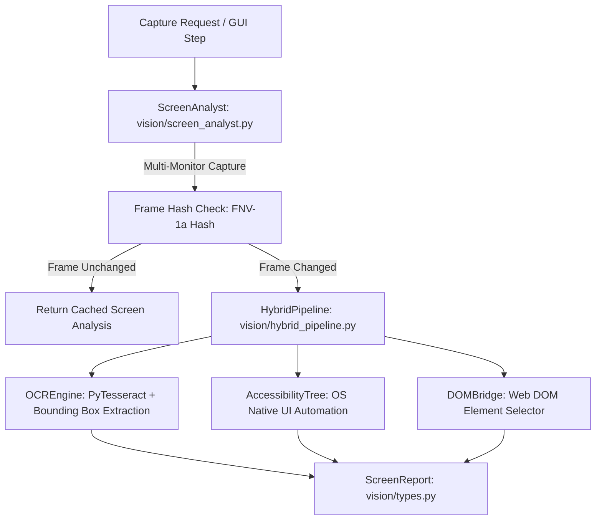

# 👁️ BR JARVIS — Vision Engine & Screen Intelligence (`vision/`)

> **Document Status**: Production Architecture Specification  
> **Subsystem**: Screen Capture, PyTesseract OCR, DOM Bridge & Visual Grounding  
> **Module Path**: `vision/`  

---

## 1. Executive Summary

The **Vision Engine** (`vision/`) provides real-time visual perception for BR JARVIS. It enables the AI Operating System to observe multi-monitor desktop environments, extract text bounding boxes via PyTesseract OCR, query operating system accessibility trees, interact with Web DOM nodes (`dom_bridge.py`), and run a hybrid visual locator pipeline (`hybrid_pipeline.py`).

---

## 2. Architecture & Vision Pipeline

---

## 3. Subsystem Components & Responsibilities

| File | Class / Subsystem | Primary Function |
|---|---|---|
| [engine.py](file:///d:/BRJARVIS/Br-Jarvis/vision/engine.py) | `VisionEngine` | Master visual coordinator registered in `CoreRuntime.container`. |
| [screen_analyst.py](file:///d:/BRJARVIS/Br-Jarvis/vision/screen_analyst.py) | `ScreenAnalyst` | High-speed multi-monitor screenshot capture with FNV-1a frame hashing to skip redundant OCR operations on static screens. |
| [ocr_engine.py](file:///d:/BRJARVIS/Br-Jarvis/vision/ocr_engine.py) | `OCREngine` | PyTesseract wrapper extracting text, confidence scores, and pixel bounding boxes `(x, y, w, h)` with SHA-256 image caching. |
| [accessibility.py](file:///d:/BRJARVIS/Br-Jarvis/vision/accessibility.py) | `AccessibilityTree` | Queries Windows UI Automation / OS accessibility frameworks to resolve UI control elements natively. |
| [dom_bridge.py](file:///d:/BRJARVIS/Br-Jarvis/vision/dom_bridge.py) | `DOMBridge` | Bridges visual coordinate space with browser DOM trees for web automation steps. |
| [hybrid_pipeline.py](file:///d:/BRJARVIS/Br-Jarvis/vision/hybrid_pipeline.py) | `HybridVisionPipeline` | Fuses OCR results, accessibility elements, and visual DOM coordinates into a unified UI map. |
| [types.py](file:///d:/BRJARVIS/Br-Jarvis/vision/types.py) | `ScreenReport`, `BoundingBox` | Pydantic v2 schemas for visual elements, coordinate bounds, and UI trees. |
