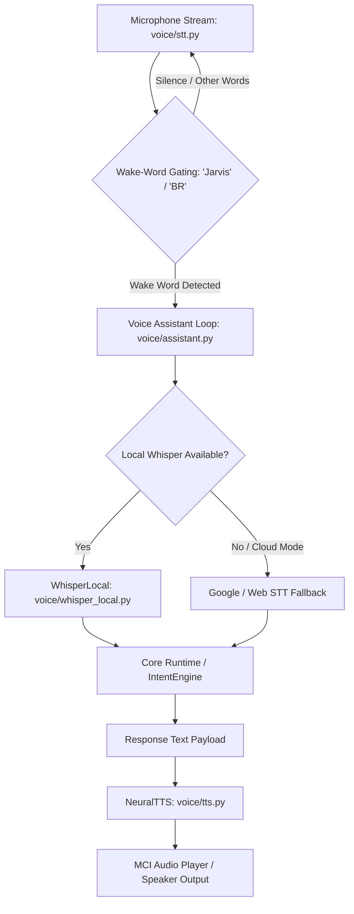

# 🎙️ BR JARVIS — Voice Assistant Subsystem (`voice/`)

> **Document Status**: Production Architecture Specification  
> **Subsystem**: Hands-Free Voice Loop, Speech Recognition & Neural TTS  
> **Module Path**: `voice/`  

---

## 1. Executive Summary

The **Voice Assistant Subsystem** (`voice/`) powers hands-free voice interaction for BR JARVIS. It features wake-word gating, offline local Automatic Speech Recognition (ASR) via OpenAI Whisper (`whisper_local.py`), cloud speech recognition fallbacks (`stt.py`), multilingual language translation (`multilingual.py`), and neural Text-to-Speech synthesis with low-latency MCI audio playback (`tts.py`).

---

## 2. Audio Processing Topology

---

## 3. Subsystem Components & Responsibilities

| File | Class / Entity | Primary Responsibility |
|---|---|---|
| [assistant.py](file:///d:/BRJARVIS/Br-Jarvis/voice/assistant.py) | `BRVoiceAssistant` | Master voice loop coordinator handling state transitions (`IDLE`, `LISTENING`, `THINKING`, `SPEAKING`), wake-word gating, and interrupts. |
| [stt.py](file:///d:/BRJARVIS/Br-Jarvis/voice/stt.py) | `SpeechToText` | `sounddevice` audio stream recorder and cloud STT service fallback interface. |
| [whisper_local.py](file:///d:/BRJARVIS/Br-Jarvis/voice/whisper_local.py) | `LocalWhisperASR` | Offline local OpenAI Whisper model worker supporting `tiny`, `base`, `small`, and `medium` quantized models. |
| [tts.py](file:///d:/BRJARVIS/Br-Jarvis/voice/tts.py) | `NeuralTTS` | Text-to-speech engine using PyTTSx3 / gTTS with Win32 MCI low-latency audio stream playback. |
| [multilingual.py](file:///d:/BRJARVIS/Br-Jarvis/voice/multilingual.py) | `MultilingualVoice` | Automatic language detection and translation wrapper supporting English, Tamil, Hindi, Spanish, French, and German. |
