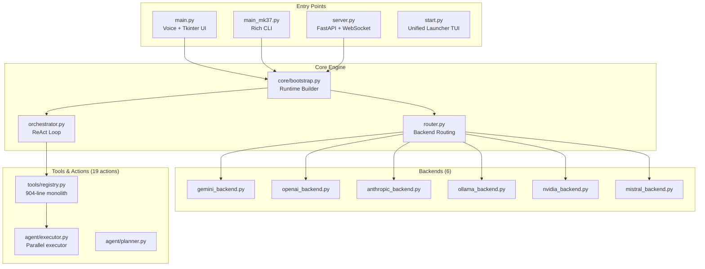

# JARVIS MK37 — Full Redesign & Upgrade Plan

Comprehensive redesign to fix all broken components, modernize the architecture, add new features, and make every module production-ready.

## User Review Required

> [!IMPORTANT]
> This is a **massive overhaul** touching 30+ files across every module. Estimated execution: multiple phases. Please review the scope and confirm priorities before I begin.

> [!WARNING]
> The `.env` file contains live API keys. All changes to backends will preserve existing key configurations. The OpenAI backend now points to `localhost:8045` — this will be preserved.

## Open Questions

> [!IMPORTANT]
> 1. **Branding**: The project uses mixed branding — "BR", "JARVIS", "B.R", "BR Core". Should I unify everything under **"JARVIS MK37"** or keep "BR"?
> 2. **Web Dashboard**: Should I rebuild the web UI from scratch with a modern design, or upgrade the existing HUD-style interface?
> 3. **Voice TTS**: The current wake word is "hey" — should it be changed to "Jarvis" or kept as-is?

---

## Current State Analysis

### Architecture Overview


### Issues Found

| # | Severity | Module | Issue |
|---|----------|--------|-------|
| 1 | 🔴 Critical | `openai_backend.py` | `gemini-3.1-pro-high` model times out on localhost proxy — only `gemini-3.1-pro-low` and `gemini-3-flash` work |
| 2 | 🔴 Critical | `tools/registry.py` | 904-line monolith with massive if/elif chain — unmaintainable, no plugin system |
| 3 | 🔴 Critical | `agent/executor.py` | Duplicate tool dispatcher — separate `_call_tool()` duplicates logic from `tools/registry.py` |
| 4 | 🟠 Major | `orchestrator.py` | ReAct loop uses raw regex `tool_call` parsing — fragile, breaks on malformed JSON |
| 5 | 🟠 Major | `server.py` | Missing `__init__.py` in root, import of `JarvisOrchestrator` is unguarded type annotation |
| 6 | 🟠 Major | `main.py` | 649-line god file mixing TTS, MCI audio, microphone, speech recognition, and UI glue |
| 7 | 🟠 Major | All backends | No shared abstract base class — each backend independently implements `complete()`/`stream()` |
| 8 | 🟠 Major | `config/models.py` | Model names hardcoded to outdated defaults (e.g., `gemini-2.5-flash`) |
| 9 | 🟡 Minor | `router.py` | All routing rules point to `GEMINI` — routing intelligence is a no-op |
| 10 | 🟡 Minor | `memory/` | Vector store silently fails if ChromaDB is missing, no user notification |
| 11 | 🟡 Minor | `web/` | Dashboard has no error handling for offline server |
| 12 | 🟡 Minor | `start.py` | Launcher menu partially broken — some options don't map to real scripts |
| 13 | 🟡 Minor | `skills/` | Skill count claims "45" but actual loaded count may differ |
| 14 | 🟡 Minor | `.env.template` | Template is out of sync with actual `.env` (missing OPENAI_BASE_URL, OPENAI_MODEL) |

---

## Proposed Changes

### Phase 1: Core Architecture & Backend Fixes
*Foundation fixes that everything else depends on.*

---

#### [NEW] `backends/base.py` — Abstract Backend Interface

Create a proper ABC that all backends must implement:

```python
class BaseBackend(ABC):
    @abstractmethod
    def complete(self, messages, system="", tools=None) -> str: ...
    
    @abstractmethod
    def stream(self, messages, system="") -> Generator[str]: ...
    
    def ping(self, timeout=2.0) -> bool: ...
    
    @property
    def name(self) -> str: ...
    
    @property
    def model_name(self) -> str: ...
```

#### [NEW] `backends/` directory — Reorganized backends

Move all `*_backend.py` files into a proper package:
- `backends/__init__.py`
- `backends/base.py` — ABC
- `backends/gemini.py` — Updated Gemini with model fallback chain fix
- `backends/openai.py` — With base_url, model, timeout support
- `backends/anthropic.py`
- `backends/ollama.py`
- `backends/nvidia.py`
- `backends/mistral.py`

All existing root-level `*_backend.py` files will be kept as thin shims (1-line re-exports) for backward compatibility.

#### [MODIFY] [router.py](file:///d:/MARKJARVIS/Jarvis-MK37/router.py)

- Make routing rules actually functional (route code tasks to GPT/Claude when available, security to Gemini, local/private to Ollama)
- Add health-check-based routing (if a backend is down, skip it)
- Add `switch_backend(profile)` method for runtime switching

#### [MODIFY] [orchestrator.py](file:///d:/MARKJARVIS/Jarvis-MK37/orchestrator.py)

- Improve tool_call parsing with fallback JSON extraction (handle malformed outputs)
- Add retry logic with exponential backoff on backend failures
- Add conversation context window management (trim old messages intelligently)
- Add timing/telemetry for each ReAct step
- Fix streaming mode to also handle tool calls (currently skips tool routing)

#### [MODIFY] [config/models.py](file:///d:/MARKJARVIS/Jarvis-MK37/config/models.py)

- Update all model defaults to 2026 models
- Add `OPENAI_BASE_URL` and `OPENAI_MODEL` to the env map
- Add model validation (check if model exists before using it)

---

### Phase 2: Tool System Redesign
*Break the 904-line monolith into a plugin architecture.*

---

#### [MODIFY] [tools/registry.py](file:///d:/MARKJARVIS/Jarvis-MK37/tools/registry.py)

Complete rewrite from if/elif chain to a decorator-based registry:

```python
@register_tool(
    name="web_search",
    description="Search the web...",
    parameters={...}
)
def tool_web_search(args: dict) -> str:
    ...
```

Split into:
- `tools/registry.py` — Core registry, decorator, schema builder, executor
- `tools/web_tools.py` — web_search, fetch_page, fetch_raw
- `tools/file_tools.py` — file_read, file_write, file_list
- `tools/code_tools.py` — run_code sandbox
- `tools/pc_tools.py` — cursor, keyboard, screen, clipboard, window tools
- `tools/memory_tools.py` — memory_save/delete/search/list
- `tools/agent_tools.py` — spawn_agent, check_agent, list_agents
- `tools/redteam_tools.py` — port_scan, dns_enum, headers_audit, etc.
- `tools/system_tools.py` — system_monitor, screen_share

Auto-discovery: tools register themselves on import.

#### [MODIFY] [agent/executor.py](file:///d:/MARKJARVIS/Jarvis-MK37/agent/executor.py)

- Remove the duplicate `_call_tool()` — use `tools/registry.execute_tool()` instead
- Add per-step timeout configuration
- Add progress callback for UI integration
- Improve error recovery with smarter replanning

---

### Phase 3: Entry Points & Server Fixes

---

#### [MODIFY] [server.py](file:///d:/MARKJARVIS/Jarvis-MK37/server.py)

- Add OpenAI-compatible `/v1/chat/completions` endpoint (so Jarvis can act as an API proxy)
- Add `/api/models` endpoint listing available backends
- Add `/api/backend/switch` endpoint for runtime backend switching
- Add `/api/memory` CRUD endpoints
- Add `/api/skills` listing endpoint
- Add proper CORS support
- Add request/response logging middleware
- Fix unguarded type annotation `JarvisOrchestrator | None`

#### [MODIFY] [main.py](file:///d:/MARKJARVIS/Jarvis-MK37/main.py)

- Split into focused modules:
  - `voice/tts.py` — NeuralTTS, MCIPlayer
  - `voice/stt.py` — SounddeviceMicrophone, wake word detection
  - `voice/assistant.py` — BRVoiceAssistant (slimmed down)
- Fix wake word to be configurable via .env (`JARVIS_WAKE_WORD=hey`)
- Add voice activity detection for better command capture

#### [MODIFY] [main_mk37.py](file:///d:/MARKJARVIS/Jarvis-MK37/main_mk37.py)

- Fix `/tools` and `/skills` commands to show accurate counts
- Add `/backend` command for runtime switching
- Add `/test` command for quick connectivity checks
- Update help text to match actual capabilities

#### [MODIFY] [start.py](file:///d:/MARKJARVIS/Jarvis-MK37/start.py)

- Fix menu options to map to actual working scripts
- Add startup health check (verify all backends before launching)
- Add auto-update check capability

---

### Phase 4: Memory & Intelligence Upgrades

---

#### [MODIFY] [memory/persistent_store.py](file:///d:/MARKJARVIS/Jarvis-MK37/memory/persistent_store.py)

- Add SQLite backend option (faster than file-per-memory)
- Add memory versioning (track changes over time)
- Add bulk import/export (JSON format)

#### [MODIFY] [memory/vector_store.py](file:///d:/MARKJARVIS/Jarvis-MK37/memory/vector_store.py)

- Add fallback to sentence-transformers if ChromaDB unavailable
- Add memory deduplication
- Improve semantic search ranking

#### [NEW] `memory/conversation_store.py`

- SQLite-based conversation history with full search
- Replace JSON-file session storage with proper DB

---

### Phase 5: Web Dashboard Rebuild

---

#### [MODIFY] [web/index.html](file:///d:/MARKJARVIS/Jarvis-MK37/web/index.html)

Complete redesign with:
- Modern glassmorphic dark UI
- Real-time streaming chat interface
- Backend status cards with live health indicators
- Memory browser & editor
- Task queue visualization
- Skill browser with one-click execution
- Settings panel for backend switching & model selection
- Mobile-responsive layout

#### [MODIFY] [web/style.css](file:///d:/MARKJARVIS/Jarvis-MK37/web/style.css)

- Complete CSS redesign with design tokens
- Micro-animations and transitions
- Inter/Outfit typography from Google Fonts

#### [MODIFY] [web/app.js](file:///d:/MARKJARVIS/Jarvis-MK37/web/app.js)

- Add streaming response rendering (typewriter effect)
- Add WebSocket reconnection with exponential backoff
- Add local settings persistence (localStorage)
- Add keyboard shortcuts
- Add copy-to-clipboard for code blocks

---

### Phase 6: New Features

---

#### [NEW] `actions/clipboard_history.py`

- Track clipboard history (last 50 items)
- Searchable clipboard with AI-powered suggestions

#### [NEW] `actions/scheduler.py`

- Cron-like task scheduler
- Recurring task support
- Natural language scheduling ("every day at 9am")

#### [NEW] `actions/email_assistant.py`

- Read/send emails via IMAP/SMTP
- Email summarization using AI

#### [NEW] Plugin System

- `plugins/` directory for community plugins
- `plugins/__init__.py` with auto-loader
- Each plugin = directory with `plugin.json` + Python module
- Hot-reload capability

---

### Phase 7: Configuration & DevOps

---

#### [MODIFY] [.env.template](file:///d:/MARKJARVIS/Jarvis-MK37/.env.template)

- Sync with current `.env` (add OPENAI_BASE_URL, OPENAI_MODEL)
- Add all new config options with documentation
- Add JARVIS_WAKE_WORD, JARVIS_LOG_LEVEL, JARVIS_PLUGIN_DIR

#### [MODIFY] [requirements_mk37.txt](file:///d:/MARKJARVIS/Jarvis-MK37/requirements_mk37.txt)

- Pin all versions to tested ranges
- Add optional dependency groups (voice, web, redteam)
- Add `psutil` (used but not listed)
- Add `speech_recognition` (used but not listed)

#### [NEW] `healthcheck.py`

- Standalone script to verify all components work
- Tests each backend connectivity
- Tests memory store
- Tests tool imports
- Generates a status report

---

## Verification Plan

### Automated Tests
```bash
python healthcheck.py          # Full system health check
python -m pytest tests/ -v     # Unit tests for all modules
python scripts/smoke_startup.py # Startup smoke test
```

### Manual Verification
- Launch each entry point (`main.py`, `main_mk37.py`, `server.py`, `start.py`) and verify boot
- Test chat through CLI, voice, web, and API
- Test OpenAI proxy connection to `localhost:8045`
- Test each backend (Gemini, OpenAI, Ollama) individually
- Test memory save/search/delete cycle
- Test parallel task execution
- Test web dashboard with live metrics

---

## Execution Order

| Phase | Scope | Est. Files |
|-------|-------|------------|
| **Phase 1** | Core Architecture & Backend Fixes | 10 files |
| **Phase 2** | Tool System Redesign | 12 files |
| **Phase 3** | Entry Points & Server | 5 files |
| **Phase 4** | Memory & Intelligence | 4 files |
| **Phase 5** | Web Dashboard Rebuild | 3 files |
| **Phase 6** | New Features | 4 files |
| **Phase 7** | Config & DevOps | 4 files |
