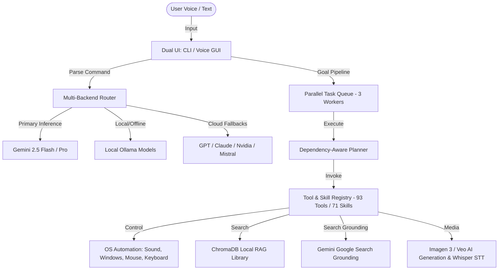

# 🤖 BR JARVIS MK37 — Next-Gen AI Assistant & OS Automation

[](https://www.python.org/)
[](LICENSE)
[](https://ai.google.dev/)
[]()

> **BR JARVIS MK37** is an autonomous, multi-modal cognitive assistant that turns natural language into direct system actions, desktop automation, multi-agent workflows, and real-time intelligence — running online or 100% offline.

---

## 💡 Key Highlights

- ⚡ **Gemini-First Core**: Powered by Google Gemini 2.5/3.5 with native Google Search grounding, multi-modal vision, and structured ReAct reasoning.
- 🔀 **Multi-Backend Intelligence**: Seamlessly switch between **Gemini**, **OpenAI/GPT**, **Anthropic Claude**, **Local Ollama** (100% offline), **NVIDIA NIM**, and **Mistral**.
- 🚀 **Parallel Task Queue**: Execute multiple complex goals simultaneously using a 3-worker multi-threaded agent execution engine.
- 🛠️ **93 Tools & 71 Skills**: Desktop/OS automation (keyboard, mouse, windows), local RAG document database, Web scraping & browsing, code generation, audio/video transcription, and image/video creation.
- 🎙️ **Hands-Free Voice & 90+ Languages**: Real-time voice interaction with lenient wake-word detection (*"Hey Jarvis"*), local OpenAI Whisper STT, and Google TTS.
- 📚 **Local RAG Document Chat**: Upload PDFs, DOCX, CSVs, or web pages into a local ChromaDB vector database and chat with your files securely.

---

## 📊 System Architecture



---

## ⚡ Quick Start (3 Steps)

### Step 1: Clone & Install Dependencies

```bash
# Clone the repository
git clone https://github.com/bharthraj1412/BrJarvis.git
cd BrJarvis

# Install Python requirements
pip install -r requirements_mk37.txt
```

### Step 2: Configure Environment

Copy `.env.template` to `.env` and add your **Gemini API Key** (Free tier available at [Google AI Studio](https://aistudio.google.com/app/apikey)):

```bash
cp .env.template .env
```

Edit your `.env` file:
```env
GEMINI_API_KEY=your_actual_gemini_api_key_here
JARVIS_ASSISTANT_NAME=BR
JARVIS_WAKE_WORD=hey
```

### Step 3: Launch BR JARVIS

```bash
# Terminal / CLI Mode (Recommended)
python main_mk37.py

# Voice Assistant Mode (Requires Microphone)
python main.py

# Full Interactive Launcher Menu
python start.py
```

---

## 🎮 How to Use BR JARVIS

### 1. Interactive CLI Mode (`python main_mk37.py`)
Type natural language prompts or use fast `/` slash commands:

- `search AI news and summarize the top 3 headlines`
- `create a python script to parse CSV files`
- `/run search news | open browser | check disk space` *(Runs 3 tasks in parallel!)*
- `/chat-pdf path/to/document.pdf` *(RAG Document Chat)*
- `/status` *(Check active system backends and tools)*

### 2. Hands-Free Voice Mode (`python main.py`)
Say **"Hey Jarvis"** followed by your command:
- *"Hey Jarvis, open Spotify and turn the volume to 50%"*
- *"Hey Jarvis, search the web for quantum computing updates"*
- *"Hey Jarvis, take a screenshot and tell me what's on screen"*

---

## 🛠️ Main Features Breakdown

| Feature | Description |
|---|---|
| **Parallel Goals (`/run`)** | Execute independent tasks concurrently using multi-threaded execution. |
| **Local RAG Library** | Store and query PDFs, DOCX, CSVs, and Web pages locally via ChromaDB vector database. |
| **OS Automation** | Control volume, open applications, simulate keystrokes, lock screen, and take screenshots. |
| **AI Writing & Code** | Write emails, generate code, debug scripts, refactor projects, and run code in a sandbox. |
| **Media Generation** | Create AI images (Gemini Imagen / DALL-E) and videos (Google Veo / Kling AI). |
| **Offline STT & Audio** | Transcribe MP3/MP4 files offline using local OpenAI Whisper. |
| **Global Hotkeys** | Instant actions via system shortcuts (`Ctrl+Shift+J` for Voice, `Ctrl+Shift+S` for Vision). |

---

## 💬 Essential CLI Slash Commands

| Command | Action |
|---|---|
| `/run goal1 \| goal2 \| goal3` | Run multiple goals in **parallel** |
| `/tasks` | View active and queued background tasks |
| `/chat-pdf <file>` | Ingest and chat with a PDF document |
| `/chat-webpage <url>` | Scrape and chat with any webpage content |
| `/skills` | List all 71 available skills |
| `/memory search <query>` | Search past conversations and memories |
| `/status` | View AI backend status and operational health |
| `/help` | Show full list of commands |
| `/quit` | Exit assistant and save session context |

---

## 🌐 Multi-Backend Configuration

BR JARVIS defaults to **Google Gemini** for high performance and low latency, but can auto-fallback or route to other backends configured in `.env` or `config/api_keys.json`:

| Provider | Model Default | Capability |
|---|---|---|
| **Gemini** | `gemini-2.5-flash` | Real-time Search Grounding, Vision, Code, ReAct Orchestration |
| **OpenAI** | `gpt-4o` | Complex reasoning, standard coding |
| **Anthropic** | `claude-3-5-sonnet` | Advanced software engineering |
| **Ollama** | `llama3` / `mistral` | 100% Offline execution without internet |
| **NVIDIA NIM** | Configurable | Accelerated inference models |

---

## 📂 Project Structure

```
BrJarvis/
├── actions/             # OS automation, RAG, Media, & Search action modules
├── agent/               # Autonomous ReAct planner, task executor, & queue
├── backends/            # LLM provider clients (Gemini, OpenAI, Claude, Ollama)
├── config/              # User settings, vocabulary overrides, & hotkeys
├── core/                # System core runtime & hardware monitor
├── memory/              # Conversation history & ChromaDB RAG storage
├── skills/              # Built-in modular capabilities & writer tools
├── voice/               # Speech-To-Text (Whisper/Google) & Text-To-Speech (TTS)
├── main_mk37.py         # Primary CLI REPL Entry Point
├── main.py              # Primary Voice Assistant Entry Point
└── start.py             # System Launcher Menu
```

---

## 🤝 Contributing

Contributions are welcome! Feel free to open an **Issue** or submit a **Pull Request** to add new tools, skills, or backends.

---

## 📜 License

Distributed under the **MIT License**. See `LICENSE` for details.
