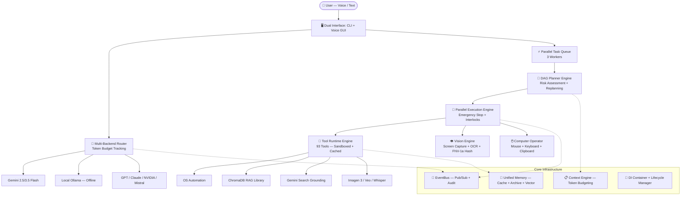

# 🧠 BR JARVIS — Local-First AI Operating System

[](https://github.com/bharthraj1412/BrJarvis/actions)
[](https://www.python.org/)
[](LICENSE)
[](https://ai.google.dev/)
[]()
[]()

> **BR JARVIS** is not a chatbot. It is a **Local-First AI Operating System** — a modular, production-grade cognitive platform that understands your computer, reasons about goals, and executes complex tasks through voice, vision, automation, memory, and planning.

---

## 🚀 What Makes BR JARVIS Different

| | Traditional Chatbots | BR JARVIS |
|---|---|---|
| **Architecture** | Single prompt → response | 12-subsystem modular OS with EventBus, DI, and DAG execution |
| **Execution** | Text replies only | Autonomous multi-step task execution with parallel workers |
| **Memory** | Session-only context | Persistent vector memory + TTL cache + archival system |
| **Vision** | None | Real-time screen capture, OCR, UI element detection |
| **Desktop Control** | None | Full keyboard, mouse, clipboard, and window management |
| **Safety** | None | Permission policies, risk assessment, human-in-the-loop interlocks |
| **Testing** | None | 45 automated tests (unit + integration), CI/CD pipeline |

---

## 📊 System Architecture



---

## 🏗️ Production-Grade Subsystems

BR JARVIS is built from **12 independent, tested subsystems** — each with its own Pydantic v2 models, EventBus integration, and DI registration:

| # | Subsystem | Module | Key Capabilities |
|---|---|---|---|
| 1 | **Core Runtime** | `core/` | Pydantic config, DI container, lifecycle management, health monitoring |
| 2 | **Event Bus** | `events/` | Async pub/sub, wildcard routing, dead letter queue, audit persistence |
| 3 | **Context Engine** | `context/` | Token accounting (tiktoken), semantic compression, priority context assembly |
| 4 | **Memory Engine** | `memory/` | TTL cache with FNV-1a hashing, memory archival, ChromaDB vector store |
| 5 | **Planner Engine** | `agent/planner_engine.py` | DAG goal decomposition, risk classification (LOW→CRITICAL), replanning |
| 6 | **Execution Engine** | `agent/executor_engine.py` | Multi-worker parallel execution, emergency stop, human approval interlocks |
| 7 | **Tool Runtime** | `tools/tool_runtime.py` | Sandboxed execution, permission validation, result caching, telemetry |
| 8 | **Plugin Platform** | `plugins/` | Dynamic loading, crash isolation, community plugin discovery |
| 9 | **Vision Engine** | `vision/` | Screen capture (mss), FNV-1a frame dedup, OCR text extraction, UI element detection |
| 10 | **Computer Operator** | `computer/` | Mouse/keyboard control (pyautogui), clipboard management, permission interlocks |
| 11 | **Voice System** | `voice/` | Wake word detection, Whisper STT, Edge TTS, 90+ language support |
| 12 | **Integration Bridge** | `core/integration.py` | Legacy↔new architecture wiring, EventBus telemetry on orchestrator & router |

---

## ⚡ Quick Start

### 1. Clone & Install

```bash
git clone https://github.com/bharthraj1412/BrJarvis.git
cd BrJarvis
pip install -r requirements_mk37.txt
```

### 2. Configure API Key

Copy `.env.template` → `.env` and add your [Gemini API Key](https://aistudio.google.com/app/apikey) (free tier available):

```env
GEMINI_API_KEY=your_gemini_api_key_here
JARVIS_ASSISTANT_NAME=BR
JARVIS_WAKE_WORD=hey
```

### 3. Launch

```bash
# CLI Mode (Recommended)
python main_mk37.py

# Voice Assistant Mode
python main.py

# Interactive Launcher
python start.py
```

---

## 🎮 Usage Examples

### CLI Mode (`python main_mk37.py`)

```
> search AI news and summarize the top 3 headlines
> create a python script to parse CSV files
> /run search news | open browser | check disk space    ← 3 tasks in parallel!
> /chat-pdf path/to/document.pdf                        ← RAG document chat
> /status                                               ← backend health check
```

### Voice Mode (`python main.py`)

Say **"Hey Jarvis"** followed by your command:
- *"Hey Jarvis, open Spotify and turn the volume to 50%"*
- *"Hey Jarvis, take a screenshot and tell me what's on screen"*
- *"Hey Jarvis, search the web for quantum computing updates"*

---

## 💬 Slash Commands

| Command | Action |
|---|---|
| `/run goal1 \| goal2 \| goal3` | Execute multiple goals in **parallel** |
| `/tasks` | View active and queued background tasks |
| `/chat-pdf <file>` | Ingest and chat with a PDF document |
| `/chat-webpage <url>` | Scrape and chat with any webpage |
| `/skills` | List all 71+ available skills |
| `/memory search <query>` | Search past conversations and memories |
| `/status` | View AI backend status and system health |
| `/mode <name>` | Switch persona (recon / coder / planner / analyst) |
| `/help` | Show full command list |
| `/quit` | Exit and save session context |

---

## 🌐 Multi-Backend Router

BR JARVIS defaults to **Google Gemini** but intelligently routes tasks to the best available backend with automatic fallback:

| Provider | Default Model | Best For | Required |
|---|---|---|---|
| **Gemini** | `gemini-2.5-flash` | Search grounding, vision, ReAct orchestration | ✅ Yes |
| **OpenAI** | `gpt-4o` | Complex reasoning, coding | Optional |
| **Anthropic** | `claude-3-5-sonnet` | Software engineering | Optional |
| **Ollama** | `llama3` / `mistral` | 100% offline execution | Optional |
| **NVIDIA NIM** | Configurable | GPU-accelerated inference | Optional |
| **Mistral** | `mistral-large` | Fast inference, multilingual | Optional |

The router tracks **token consumption** per request and emits `model.route.selected` events for monitoring.

---

## 📂 Project Structure

```
BrJarvis/
├── .github/workflows/   # CI/CD pipeline (GitHub Actions)
├── actions/             # OS automation, RAG, media, search modules
├── agent/               # Planner engine, executor engine, task queue
├── backends/            # LLM provider clients (Gemini, GPT, Claude, Ollama, NVIDIA, Mistral)
├── br_archetecture/     # Engineering knowledge base & documentation
├── computer/            # Desktop automation operator (mouse, keyboard, clipboard)
├── config/              # User settings, vocabulary, hotkeys
├── context/             # Token accounting & semantic context compression
├── core/                # Runtime, DI container, lifecycle, health, retry, error middleware
├── events/              # Async EventBus with pub/sub, audit store, DLQ
├── memory/              # Unified memory (cache + archive + vector + conversation)
├── multi_agent/         # Sub-agent spawning & coordination
├── plugins/             # Dynamic plugin loading & crash isolation
├── skills/              # 71+ built-in modular capabilities
├── tools/               # 93 tools — unified registry + sandboxed runtime
├── tests/               # 27 unit tests + 18 integration tests (45 total)
│   └── integration/     # 30 scenario integration test suite
├── vision/              # Screen capture, OCR, UI element detection
├── voice/               # Whisper STT, Edge TTS, wake word, 90+ languages
├── main_mk37.py         # CLI REPL entry point
├── main.py              # Voice assistant entry point
├── start.py             # System launcher menu
└── server.py            # FastAPI REST/WebSocket server
```

---

## 🧪 Testing

BR JARVIS maintains **45/45 tests passing** across unit and integration suites:

```bash
# Run full test suite
python -m pytest tests/ -v

# Run only integration tests
python -m pytest tests/integration/ -v

# Run smoke startup check
python scripts/smoke_startup.py
```

### Test Coverage

| Category | Tests | Scenarios Covered |
|---|---|---|
| Core Runtime | 6 | Config, DI, lifecycle, process supervisor, health monitor |
| Event Bus | 3 | Pub/sub, event store query, dead letter queue |
| Context Engine | 4 | Token counting, compression, context building |
| Memory Engine | 3 | TTL cache, archival, unified memory |
| Planner Engine | 2 | Risk assessment, failure replanning |
| Execution Engine | 2 | Parallel DAG execution, human interlocks |
| Tool Runtime | 2 | Registration, sandboxed execution |
| Plugin Manager | 1 | Dynamic discovery |
| Vision Engine | 3 | Screen capture, OCR, analysis pipeline |
| Computer Operator | 1 | Action execution |
| **Integration Suite** | **18** | **Vision+operator, file ops, terminal/git, memory persistence, parallel stability, API fallback, emergency stop, OCR accuracy** |

---

## 🛣️ Roadmap

- [x] **Phase 1** — Core Subsystems Foundation (Subsystems 1–10)
- [x] **Phase 1.5** — Integration & Validation (Bridge, tests, CI/CD, refactoring)
- [ ] **Phase 2** — Reasoning Engine (Chain-of-thought, hypothesis, evidence evaluation)
- [ ] **Phase 3** — Workflow Engine (DSL, conditional branching, loops)
- [ ] **Phase 4** — Voice System Overhaul (Streaming STT/TTS, wake word engine)
- [ ] **Phase 5** — Desktop UI Platform (Web dashboard, real-time monitors)
- [ ] **Phase 6** — Enterprise & SDK (Plugin SDK, REST gateway, multi-tenant)

See [ROADMAP.md](br_archetecture/ROADMAP.md) for detailed phase breakdowns.

---

## 🤝 Contributing

Contributions are welcome! Feel free to open an **Issue** or submit a **Pull Request** to add new tools, skills, or backends.

See [CONTRIBUTING.md](br_archetecture/CONTRIBUTING.md) for guidelines.

---

## 📜 License

Distributed under the **MIT License**. See `LICENSE` for details.
