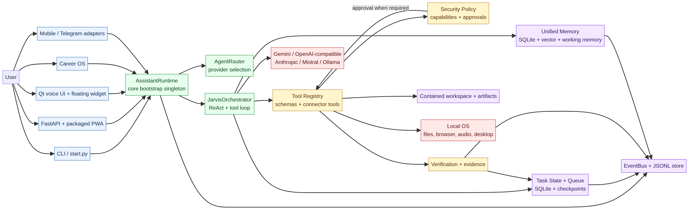
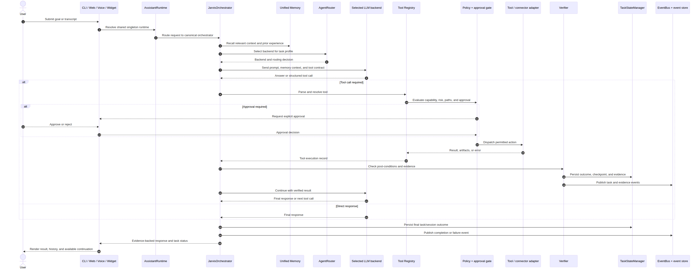
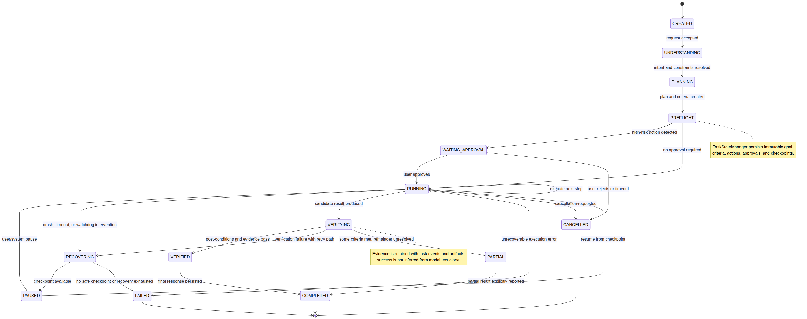

# BRJARVIS

[](https://github.com/bharathrajp14/BrJarvis/actions)
[](LICENSE)
[](https://www.python.org/)
[](https://github.com/bharathrajp14/BrJarvis)

**BRJARVIS** is a local-first, multimodal AI operating environment for dependable task execution, software work, system automation, voice interaction, personal memory, connectors, and Career OS workflows. It presents several user-facing surfaces over one canonical Python runtime: a FastAPI/PWA control plane, a terminal CLI, Qt voice and desktop surfaces, a floating widget, and Career OS.

> **Design principle:** presentation surfaces are adapters. Runtime ownership belongs to the shared `AssistantRuntime`, which wires configuration, provider routing, orchestration, tools, policy, memory, task state, events, and lifecycle management.

> **Repository:** [github.com/bharathrajp14/BrJarvis](https://github.com/bharathrajp14/BrJarvis)

## Contents

- [What the project provides](#what-the-project-provides)
- [Architecture at a glance](#architecture-at-a-glance)
- [Request lifecycle](#request-lifecycle)
- [Durable task state](#durable-task-state)
- [Requirements and compatibility](#requirements-and-compatibility)
- [Installation](#installation)
- [Configuration and security](#configuration-and-security)
- [Running the system](#running-the-system)
- [Web control plane](#web-control-plane)
- [Voice and floating-widget workflows](#voice-and-floating-widget-workflows)
- [Memory, history, and persistence](#memory-history-and-persistence)
- [Tools, connectors, and approvals](#tools-connectors-and-approvals)
- [Career OS](#career-os)
- [Testing and release verification](#testing-and-release-verification)
- [Repository map](#repository-map)
- [Troubleshooting](#troubleshooting)
- [Operational boundaries and known complexity](#operational-boundaries-and-known-complexity)
- [Documentation index](#documentation-index)
- [License](#license)

## What the project provides

BRJARVIS is intended to behave as one assistant regardless of how a request enters the system. The CLI, web workspace, voice UI, floating widget, Career OS, and remote adapters resolve the same runtime singleton rather than independently constructing provider clients and memory stores.[1] This prevents split sessions, invisible event buses, and inconsistent task state between surfaces.

| Surface | Primary role | Recommended launcher |
|---|---|---|
| Web workspace | Authenticated FastAPI control plane, packaged PWA, task views, conversations, artifacts, connectors, memory, voice, and Career OS routes | `jarvis-server` or `python start.py web` |
| CLI | Interactive REPL, slash commands, and one-shot natural-language requests | `jarvis-cli` or `python start.py cli` |
| Floating widget | Compact Orb/Rail assistant with command entry, task history, voice capture, and workspace handoff | `python start.py floating` |
| Voice assistant | Dedicated Qt voice/HUD surface with microphone and speech playback | `python start.py voice` |
| Career OS | Career studio, application tracking, CRM records, scoring, and synchronization | `python start.py career` |
| Diagnostics | Status, doctor, smoke, audio, and environment readiness checks | `jarvis status`, `python start.py doctor`, `python start.py smoke` |

## Architecture at a glance

The maintained composition root is `src/brjarvis/core/bootstrap.py`. `build_assistant_runtime()` loads available model backends, creates the `AgentRouter`, creates the `JarvisOrchestrator`, registers shared instances in the dependency container, installs shutdown handling, and publishes the startup event.[1]



The editable diagram source is [`docs/architecture/system-context.mmd`](docs/architecture/system-context.mmd). The existing production ownership map remains available as [`docs/architecture/production-architecture.png`](docs/architecture/production-architecture.png) and [`docs/architecture/production-architecture.mmd`](docs/architecture/production-architecture.mmd).

### Runtime ownership

| Layer | Maintained responsibility | Representative implementation |
|---|---|---|
| Presentation adapters | Translate CLI, HTTP, WebSocket, voice, desktop, or Career OS input into runtime calls | `src/brjarvis/apps`, `src/brjarvis/web`, `src/brjarvis/desktop`, `start.py` |
| Composition root | Load environment, create the singleton runtime, register dependencies, and attach lifecycle hooks | `src/brjarvis/core/bootstrap.py` |
| Provider routing | Select an available backend and expose a common model interface | `src/brjarvis/router`, `src/brjarvis/integrations/backends` |
| Orchestration | Recall context, construct prompts, parse tool calls, enforce loop limits, execute tools, and synthesize evidence-backed responses | `src/brjarvis/orchestrator/core.py` |
| Tool governance | Register schemas, check capabilities and paths, request approvals, dispatch adapters, and contain artifacts | `src/brjarvis/tools`, `src/brjarvis/security` |
| Durable execution | Persist task state, checkpoints, approvals, evidence, and terminal outcomes | `src/brjarvis/agent/task_state.py`, `src/brjarvis/workflow` |
| Memory and history | Maintain working, structured, vector, conversation, session, and audit records | `src/brjarvis/memory`, `src/brjarvis/history` |
| Events and operations | Broadcast lifecycle events, persist bounded event history, expose diagnostics, and coordinate shutdown | `src/brjarvis/events`, `src/brjarvis/diagnostics`, `src/brjarvis/core/lifecycle.py` |

## Request lifecycle

A request is not considered complete merely because a language model produced text. The canonical loop recalls context, selects a provider, parses structured tool calls, evaluates policy, dispatches permitted work, verifies post-conditions, persists evidence, and returns the resulting status to the presentation surface.[2]



The editable source is [`docs/architecture/request-lifecycle.mmd`](docs/architecture/request-lifecycle.mmd).

The orchestrator applies defensive limits to prevent unbounded re-entrant tool execution. The maintained implementation defines a maximum tool-iteration cap and cyclic-call thresholds, cleans tool-call markup from user-facing output, and builds summaries from recorded tool results instead of trusting model claims.[2]

## Durable task state

Task execution is represented as a persisted state machine. The task contract stores the immutable goal, criteria, actions, approval requests, checkpoints, artifacts, evidence, and status transitions. The workflow layer adds dependency-aware DAG execution, cycle detection, topological ordering, parallel execution of independent work, resource-conflict control, and checkpointing.[3]



The editable source is [`docs/architecture/task-state-machine.mmd`](docs/architecture/task-state-machine.mmd).

| Outcome class | Meaning |
|---|---|
| `COMPLETED` / `VERIFIED` | Required post-conditions passed and the final response was persisted. |
| `PARTIAL` | Some criteria or steps completed, but the remaining work could not be completed or verified. |
| `FAILED` | Execution or recovery reached an unrecoverable error. |
| `CANCELLED` | The user or system cancelled the task, or an approval gate timed out or was rejected. |
| `PAUSED` / `WAITING_APPROVAL` | Work is intentionally resumable but not currently executing. |
| `RECOVERING` | A watchdog or startup recovery path is reconstructing a safe continuation from persisted state. |

## Requirements and compatibility

Use a project-local virtual environment. Package metadata requires **Python 3.11 through 3.14** (`>=3.11, <=3.14`), while the supplied setup scripts are written for the currently supported 3.11–3.13 development range.[4]

The base installation includes the FastAPI server, Uvicorn, Pydantic, Rich, provider SDK for Google GenAI, configuration loading, HTTP clients, keyring support, and cryptographic primitives. Hardware-bound and capability-specific features are optional because microphone input, speech recognition, text-to-speech, desktop automation, browser automation, document generation, and alternate LLM providers need additional packages and compatible operating-system support.[4]

| Capability | Extra | Main dependencies or platform considerations |
|---|---|---|
| Voice input and output | `voice` | `sounddevice`, `SpeechRecognition`, `edge-tts`, `faster-whisper`, ONNX Runtime, NumPy |
| Desktop and screen automation | `automation` | PySide6, PyAutoGUI, Pillow, MSS, OpenCV, clipboard support |
| Web search and browser automation | `web` | DDGS, BeautifulSoup, Playwright, Selenium, WebSockets, YouTube transcript support |
| Documents and spreadsheets | `documents` | `python-docx`, `python-pptx`, `fpdf2`, `openpyxl`, `pypdf` |
| Alternate model providers | `llm-backends` | OpenAI-compatible, Anthropic, and Mistral SDKs |
| Windows integration | `windows` | Windows-only automation, audio, window, keyboard, and shell helpers |
| Development and release checks | `dev` | Pytest, coverage, Ruff, Pyright, build, audit, secret scanning, import-linter |

## Installation

### Windows PowerShell

```powershell
git clone https://github.com/bharathrajp14/BrJarvis.git
Set-Location BrJarvis
.\setup_env.bat --dev
.\.venv\Scripts\Activate.ps1
python -m pip install -e ".[all,dev]"
```

### Linux or macOS

```bash
git clone https://github.com/bharathrajp14/BrJarvis.git
cd BrJarvis
./setup_linux.sh --dev
source .venv/bin/activate
python -m pip install -e '.[all,dev]'
```

The setup scripts create `.venv`, install development dependencies, run dependency validation, and initialize `.env` from `.env.template` when needed. For a smaller installation, choose only the features required by your workflow:

```bash
python -m pip install -e '.[voice,automation]'
python -m pip install -e '.[web,documents,llm-backends]'
```

Do not install into system Python, use `--no-deps`, or bypass dependency resolution. Those shortcuts make provider, audio, Qt, and native-platform failures difficult to diagnose.

## Configuration and security

Copy the template before starting the web control plane:

```bash
cp .env.template .env
python -c "import secrets; print(secrets.token_urlsafe(32))"
```

Set the generated value as `JARVIS_SERVER_API_KEY`. A secure local baseline is:

```dotenv
JARVIS_SERVER_API_KEY=<unique-random-value-at-least-24-characters>
JARVIS_PERMISSION_MODE=confirm_destructive
JARVIS_HEADLESS=false
JARVIS_ENABLE_UNSAFE_HOST_EXECUTION=false
JARVIS_ENABLE_UNTRUSTED_PLUGINS=false
JARVIS_COOKIE_SECURE=true
JARVIS_CORS_ORIGINS=https://your-approved-origin.example
```

| Control | Default or recommended behavior |
|---|---|
| Server authentication | API routes accept a valid bearer token, `X-API-Key`, or verified session token when the server key is configured. |
| Destructive actions | Require confirmation under `confirm_destructive`. |
| Host code execution | Disabled unless explicitly enabled. |
| Untrusted plugins | Disabled unless explicitly trusted. |
| Workspace paths | Canonicalized and checked against allowed roots before use. |
| Artifacts | Written to contained workspace/artifact locations rather than arbitrary paths. |
| Cookies and transport | `JARVIS_COOKIE_SECURE=true` assumes HTTPS, normally terminated by a trusted reverse proxy. |
| CORS | Keep `JARVIS_CORS_ORIGINS` limited to approved origins; do not use a broad wildcard for credentialed traffic. |
| Credentials | Prefer the operating-system keyring. Never commit provider keys to source, prompts, logs, generated artifacts, or JSON metadata. |

Localhost is not an authentication boundary. Do not expose the control plane directly to an untrusted network. Rotate any credential that has ever been committed; deleting the file does not invalidate the provider-side secret.

## Running the system

After activating the virtual environment, the installed entry points are:

```bash
jarvis status
jarvis-cli
jarvis-server
```

The source-checkout dispatcher in `start.py` exposes the complete operational surface:

```bash
python start.py status
python start.py doctor
python start.py doctor --fix
python start.py web --port 8000
python start.py cli
python start.py floating
python start.py voice
python start.py career
python start.py career sync
python start.py smoke
python start.py audio
python start.py test
python start.py version
```

A one-shot natural-language request can be passed directly:

```bash
python start.py "summarize the current project status"
```

Use `python start.py help` for the launcher’s current command summary. Use `doctor --fix` only when you understand the repair actions it may perform.

## Web control plane

`src/brjarvis/web/api/server.py` is the canonical FastAPI application factory. Its lifespan builds the shared runtime in a worker thread, attaches the orchestrator, runs crash recovery, activates WebSocket log streaming, and shuts down the queue, event store, and orchestrator in an orderly sequence.[5]

The application mounts authentication, health, tasks, conversations, projects, artifacts, search, notifications, automations, devices, routines, skills, connectors, memory, chat, voice, WebSocket, and Career OS routers at both unversioned and `/api/v1` paths.[5] The packaged PWA is served from the web package with explicit no-cache headers for HTML, JavaScript, and service-worker assets so browser upgrades do not silently retain stale clients.

| Web concern | Behavior |
|---|---|
| Authentication | API key or verified session token for protected API paths. |
| Browser protection | Security headers including `nosniff`, frame denial, strict referrer policy, and a configured content-security policy. |
| Realtime updates | Authenticated WebSocket routes forward EventBus and task lifecycle updates. |
| Static client | Packaged PWA, SPA fallback, `/web`, `/galaxy`, and related static assets. |
| Startup recovery | Persisted interrupted tasks are inspected and recovered or failed according to checkpoint availability. |
| Shutdown | WebSocket logging is deactivated; queue, event store, and orchestrator are stopped with bounded waits. |

## Voice and floating-widget workflows

The floating surface separates presentation, runtime, and voice responsibilities:

| Module | Responsibility |
|---|---|
| `floating_surface.py` | Qt Orb, Command Rail, Context Card, controls, and task-history rendering. |
| `floating_runtime.py` | State transitions, command submission, backend coordination, generation guards, history updates, and workspace handoff. |
| `floating_voice.py` | Microphone capture, manual-stop lifecycle, WAV conversion, transcription, and speech playback coordination. |
| `float_widget.py` | Historical launcher contract and headless fallback when Qt is unavailable. |

The manual-stop flow is deliberately explicit:

1. Select **MIC** to begin recording.
2. Speak the complete instruction; silence does not normally end capture.
3. Select **STOP** to finalize the buffer.
4. Convert the audio to WAV and transcribe it.
5. Refine the transcript into a concise project instruction without executing it.
6. Submit the refined instruction to the canonical orchestrator.
7. Render the evidence-backed response in task history and optionally replay it through speech output.

Starting another command or shutting down cancels active recording and playback. Generation guards prevent stale callbacks from overwriting newer UI state. Selecting **Open workspace** checks backend readiness, starts the local server if necessary, waits for readiness, requests a one-time authenticated handoff, and then opens the workspace.

The detailed feature contract is [`docs/FLOATING_WIDGET_VOICE_PROJECT_PLAN.md`](docs/FLOATING_WIDGET_VOICE_PROJECT_PLAN.md).

## Memory, history, and persistence

BRJARVIS uses multiple persistence roles rather than treating a single chat transcript as memory. Working memory supports the active context window; structured and unified memory store durable preferences, projects, entities, and operational findings; vector memory supports relevance retrieval when available; conversation and session stores preserve interaction history; audit writers and event stores provide operational traceability.[2]

The CLI exposes concise memory and activity inspection commands:

```text
/memory
/memory search <query>
/memory recent
/memory project
/memory stats
/tasks
/history
/mode <general|recon|exploit|report|planner|coder|analyst>
```

The memory subsystem is designed to degrade gracefully when optional vector storage is unavailable. Durable task state and evidence remain separate from model-generated prose so recovery and verification can be reasoned about deterministically.

## Tools, connectors, and approvals

Tools are registered through schemas and resolved by the tool registry. Connector tools are auto-registered when the connector hub is available. Before dispatch, policy evaluates capability, risk, approval requirements, and path constraints; execution adapters then return a recorded result that can be verified.[2]

This separation is intentional. A model may propose a tool call, but the proposal is not itself authorization. High-risk actions require the configured approval mode, untrusted plugins remain disabled by default, and artifacts are contained before they are written or exposed.

## Career OS

Career OS is a first-class domain over the shared runtime rather than a separate assistant. It provides a studio route, CRM records, application tracking, profile and resume workflows, job matching/scoring, notifications, and synchronization helpers. The primary commands are:

```bash
python start.py career
python start.py career stats
python start.py career sync
```

Career records are persisted through the Career CRM subsystem. Use `career stats` for a compact listing and `career sync` when the configured synchronization path is available.

## Testing and release verification

The project defines unit, smoke, integration, end-to-end, adversarial, reliability, and benchmark markers in `pyproject.toml`.[4] The maintained default suite excludes benchmarks:

```bash
python -m pytest tests -m "not benchmark" -q --tb=short --timeout=60
```

A focused regression pass for the recent runtime, voice, web, WebSocket, CLI, and Career OS boundaries is:

```bash
python -m pytest -q \
  tests/unit/test_floating_voice.py \
  tests/unit/test_floating_runtime.py \
  tests/unit/test_float_widget_qt.py \
  tests/test_web_workspace.py \
  tests/integration/test_fastapi_web_routes.py \
  tests/integration/test_websocket_hub.py \
  tests/unit/test_cli_repl.py \
  tests/integration/test_career_os_integration.py
```

Run static and packaging checks before release:

```bash
python -m pip check
python -m ruff check .
python -m pyright
python -m py_compile src/brjarvis/desktop/floating_voice.py \
  src/brjarvis/desktop/floating_runtime.py \
  src/brjarvis/desktop/floating_surface.py \
  src/brjarvis/web/api/routes/voice.py
node --check src/brjarvis/web/static/app.js
git diff --check
python -m build
python -m pip_audit
```

For production-style verification, follow [`docs/runbooks/PRODUCTION_OPERATIONS.md`](docs/runbooks/PRODUCTION_OPERATIONS.md) and test the built wheel outside the source checkout. Avoid using `runtime`, `workspace`, `scratch`, and generated history trees as test discovery roots; the pytest configuration deliberately excludes them.[4]

## Repository map

```text
BrJarvis/
├── src/brjarvis/
│   ├── agent/             Task contracts, state, planning, verification, recovery
│   ├── apps/              Bootstrap, CLI, web, and surface adapters
│   ├── career/            Career OS, CRM, profiles, matching, and sync
│   ├── connectors/        Connector hub, discovery, and adapter contracts
│   ├── core/              Config, paths, DI, lifecycle, runtime, CLI, bootstrap
│   ├── desktop/           Qt surfaces, voice, HUD, floating widget
│   ├── diagnostics/       Doctor, smoke, and environment readiness checks
│   ├── events/             Event bus, event types, and durable event storage
│   ├── history/            Sessions, audit records, replay, and linking
│   ├── integrations/      LLM backends and mobile integrations
│   ├── memory/             Unified, structured, vector, conversation, and working memory
│   ├── multi_agent/       Subagent coordination
│   ├── orchestrator/      Canonical ReAct execution loop
│   ├── reasoning/         Decision, cognitive-loop, and speculative reasoning helpers
│   ├── router/             Provider routing and task profiles
│   ├── security/          Capabilities, credentials, path policy, permissions, sanitization
│   ├── skills/             Built-in skills, installers, connectors, and domain extensions
│   ├── tools/              Tool schemas, registry, sandbox, policy, and execution adapters
│   └── web/                FastAPI app, routes, WebSocket hub, PWA, and static assets
├── docs/                   Architecture, forensic analysis, operations, security, testing, and plans
├── tests/                  Unit, integration, smoke, e2e, adversarial, reliability, and benchmarks
├── scripts/                Setup, smoke, diagnostics, migration, and maintenance helpers
├── start.py                Source-checkout multi-mode dispatcher
├── main.py                 Compatibility launcher
├── server.py               Compatibility web-server launcher
├── pyproject.toml          Metadata, dependencies, extras, entry points, and quality settings
├── setup_env.bat           Windows setup
└── setup_linux.sh          Linux/macOS setup
```

Generated state and local operational data may appear under `.jarvis`, `runtime`, `workspace`, `BR_WORKSPACE`, `memory`, `notes`, or `scratch`. Treat those trees as runtime data, not maintained package boundaries.

## Troubleshooting

| Symptom | First checks |
|---|---|
| No provider is available | Run `python start.py status`, inspect `.env`, and confirm at least one supported provider key or local backend is configured. |
| Web server refuses to start | Confirm `JARVIS_SERVER_API_KEY`, run `python start.py doctor`, and check whether the requested port is already occupied. The launcher searches for a nearby available port. |
| Protected API returns `401` | Supply `Authorization: Bearer <key>`, `X-API-Key`, or a valid session cookie. Confirm the key matches the server process environment. |
| Voice capture is unavailable | Install the `voice` extra, run `python start.py audio`, confirm OS microphone permissions, and check audio input/output devices. |
| Qt or floating widget fails | Install the `automation` extra and run with a compatible desktop session. In headless environments use the CLI or web surface. |
| Tasks remain after a crash | Start the web server or run diagnostics so the recovery watchdog can inspect persisted checkpoints. Review task events and the production operations runbook. |
| Stale PWA assets appear | Hard-refresh the browser and confirm the packaged static files are being served with no-cache headers. |
| Tests discover unexpected files | Use the configured pytest command; generated runtime, workspace, scratch, and history directories are intentionally excluded. |
| A connector is missing | Confirm its optional dependency and credentials, then inspect connector discovery and the tool registry diagnostics. Never place real credentials in repository metadata. |

## Operational boundaries and known complexity

The repository has a strong maintained runtime, but it also contains historical launchers, legacy modules, generated state, and multiple compatibility layers. The canonical direction is the installable package under `src/brjarvis`, the shared `AssistantRuntime`, `JarvisOrchestrator`, `TaskStateManager`, tool registry, security policy, and FastAPI factory. Root-level compatibility launchers and older subsystem trees should be treated as migration or compatibility surfaces until their ownership is explicitly consolidated.

The forensic record identifies evolutionary complexity around competing bootstrap paths, historical action/tool implementations, fragmented memory storage, and multiple provider gateway layers.[6] This is not a reason to bypass the current runtime; it is a reason to keep new features behind the maintained composition root, add regression coverage at subsystem boundaries, and update architecture records when ownership changes.

## Documentation index

| Document | Purpose |
|---|---|
| [`docs/architecture/system-context.png`](docs/architecture/system-context.png) | New high-level system context diagram. |
| [`docs/architecture/request-lifecycle.png`](docs/architecture/request-lifecycle.png) | New request-to-verification sequence diagram. |
| [`docs/architecture/task-state-machine.png`](docs/architecture/task-state-machine.png) | New durable task-state diagram. |
| [`docs/architecture/production-architecture.png`](docs/architecture/production-architecture.png) | Existing production ownership and hardening map. |
| [`docs/FLOATING_WIDGET_VOICE_PROJECT_PLAN.md`](docs/FLOATING_WIDGET_VOICE_PROJECT_PLAN.md) | Floating widget voice, history, and workspace handoff contract. |
| [`docs/runbooks/PRODUCTION_OPERATIONS.md`](docs/runbooks/PRODUCTION_OPERATIONS.md) | Setup, security, validation, startup, shutdown, monitoring, and rollback. |
| [`docs/audit/PRODUCTION_READINESS_2026-08-19.md`](docs/audit/PRODUCTION_READINESS_2026-08-19.md) | Production-readiness assessment and residual risks. |
| [`docs/forensic/25_FINAL_ANALYSIS.md`](docs/forensic/25_FINAL_ANALYSIS.md) | Repository-wide forensic analysis summary. |
| [`CHANGELOG.md`](CHANGELOG.md) | Version history and compatibility notes. |

## References

[1]: src/brjarvis/core/bootstrap.py "Maintained composition root and AssistantRuntime singleton"
[2]: src/brjarvis/orchestrator/core.py "Canonical ReAct orchestrator, memory recall, tool dispatch, loop limits, and evidence synthesis"
[3]: src/brjarvis/agent/task_state.py "Durable task state contract, approvals, checkpoints, and outcomes"
[4]: pyproject.toml "Package metadata, dependencies, extras, entry points, pytest markers, and quality configuration"
[5]: src/brjarvis/web/api/server.py "FastAPI application factory, security middleware, route composition, lifespan, and PWA serving"
[6]: docs/forensic/25_FINAL_ANALYSIS.md "Repository-wide forensic analysis and known architectural complexity"

## License

BRJARVIS is released under the [MIT License](LICENSE).
